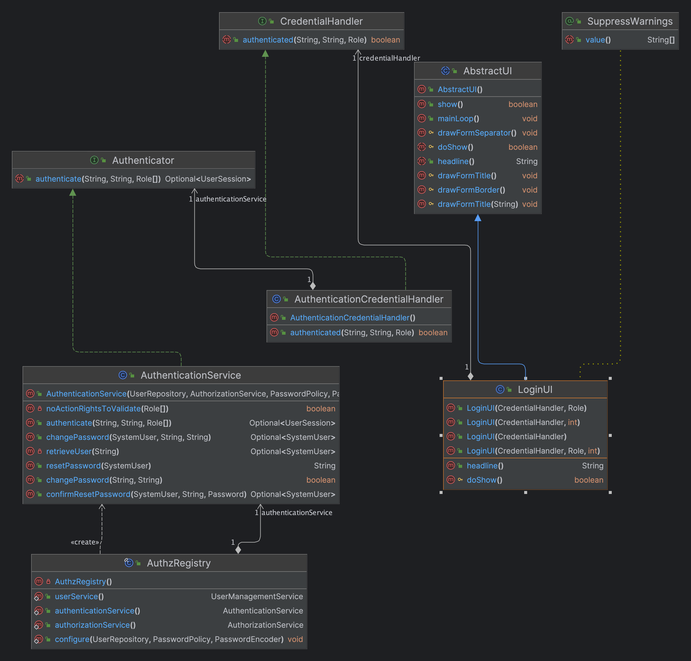

# US G007

## 1. Context

This task, identified as "US G007", is being assigned for the first time. The context for this task is to create authentication for all users.
To achieve this, we use a common application that will be used by all users. This approach will reduce the complexity of the system and make it easier to maintain and scale.

## 2. Requirements

**US G007** As a Project Manager, I want the system to support and apply authentication and authorization for all its users and functionalities

## 3. Analysis

## Business Rules

- There are three applications:
  - The backoffice application
  - The customer application
  - The candidate application
- The backoffice application is used by the operator, customer manager and the system administrator
- The customer application is used by the customer
- The candidate application is used by the candidate
- Only users authenticated in the backoffice application can access the backoffice application
- Only users authenticated in the customer application can access the customer application
- Only users authenticated in the candidate application can access the candidate application

## 4. Design

### 4.1. Realization

### 4.2. Class Diagram

### 4.3. Applied Patterns

In the development of this task, we utilized several design patterns to structure our code and ensure its maintainability and scalability. These patterns include:  
- **Repository Pattern:** The Repository pattern was used to create an abstraction layer between the data access layer and the business logic layer of the application. This helps to decouple the application and make it easier to maintain and test.  
- **Service Pattern:** The Service pattern was used to encapsulate business logic and rules. This pattern provides a set of methods that any client application can use, and these methods implement the business rules and logic.  

## 5. Implementation
The process of logging in a user in this system involves several components working together. Here's a step-by-step explanation:

- **User Interface (LoginUI.java)**: The process starts in the LoginUI class, which is responsible for interacting with the user. It prompts the user to enter their email and password. This class uses the AuthenticationCredentialHandler to handle the authentication process.

- **Credential Handler (AuthenticationCredentialHandler.java)**: The AuthenticationCredentialHandler class is the bridge between the UI and the authentication logic. It uses the Authenticator service to authenticate the user.

- **Authenticator (Authenticator.java)**: The Authenticator class is where the actual authentication logic resides. It uses the UserRepository to interact with the database. When a user attempts to log in, it retrieves the SystemUser object associated with the provided email from the database using the UserRepository, and then verifies that the provided password matches the password of the retrieved SystemUser.

- **Repository (UserRepository):** The UserRepository is an interface that defines the methods for interacting with the database. It extends the DomainRepository interface, which provides methods for basic CRUD operations. In the context of user authentication, it provides a method for retrieving a SystemUser by email.

## 6. Integration/Demonstration

### Integration

We seamlessly integrated our login functionality by using the authentication that is in eCafetaria project, done by Eapli's professor 

### Demonstration

To demonstrate the functionality and the handling of invalid inputs, follow the steps below:  
1. Start the application.
2. Navigate to the Login section.
3. In the form that appears, enter the email and password of an existing user. 
4. Submit the form. If the credentials are correct, the system should successfully log in the user and display the respective User Home Page.
5. To confirm the handling of invalid inputs, try to log in with an incorrect password or a non-existing email. The system should display an error message.

This process demonstrates the system's ability to validate user credentials and successfully log in a user with valid details.

## 7. Observations

One observation to note is that the system does not currently provide a way for users to recover or reset their password if they forget it. 