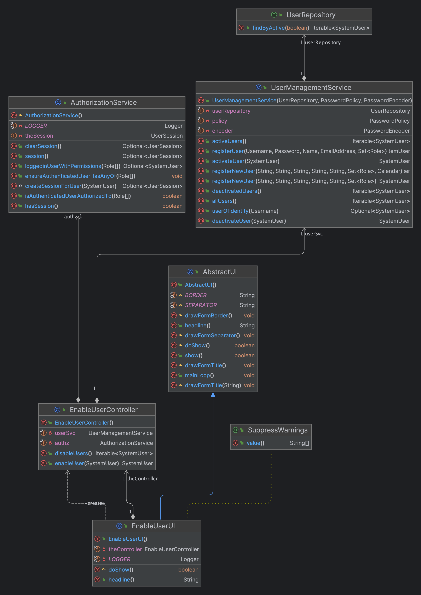

# Analysis

## Client Meeting

- The enable/disable of users is only to control access to the system.

## Business Rules

- When a user is initially created, it is in the enable state.
- This US is directly related to the users of the backoffice.
- To make this change, the user must be of the admin type.
- A user now has an enable or disable state
- This state will be important in the future for the possibility of accessing the system
- It's only possible to disable a user if the user is enabled
- It's only possible to enable a user if the user is disabled

## Unit Tests

- EnsureNewlyUserIsEnable - When a user is initially created, it is in the enable state
- EnsureUserIsDisable - Ensure if it's possible to disable a user
- EnsureUserIsEnable - Ensure if it's possible to enable a user

---

# Design

- Use the standard base structure of the layered application

### Domain Classes

- SystemUser and its associated classes

### Controller

- EnableUserController for enable user

- DisableUserController for disable user

### Service

- UserManagementService

### Repository

- UserRepository

# Test Plan

## Case #1: Enable User (existing disable users)

1. Log in as admin
2. Choose the Option User > Enable User
3. Display all the users in disable state
4. Choose a user to update
5. Confirm the update made through List users (User > List Users)

## Case #2: Enable User (does not exist disable users)

1. Log in as admin
2. Choose the Option User > Enable User
3. Display a message "There are no users to enable"

## Case #3: Disable User (existing enable users)

1. Log in as admin
2. Choose the Option User > Disable User
3. Display all the users in enable state
4. Choose a user to update
5. Confirm the update made through List users (User > List Users)

## Case #4: Disable User (does not exist enable users)

1. Log in as admin
2. Choose the Option User > Disable User
3. Display a message "There are no users to disable"
   

# Sequence Diagram

## Enable User

## Disable User

# Class Diagram

## Enable User

## Disable User

