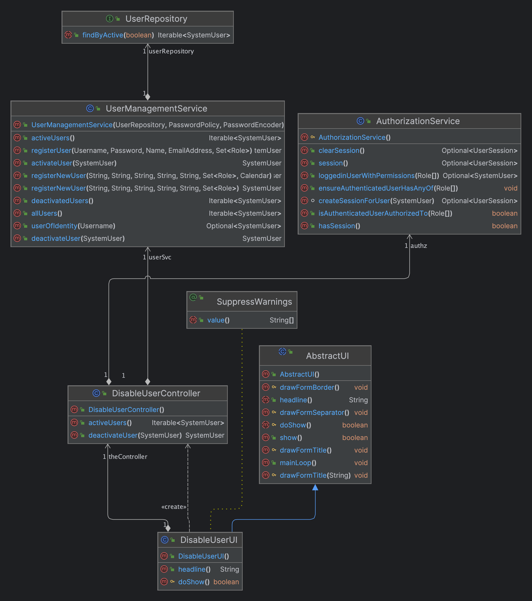
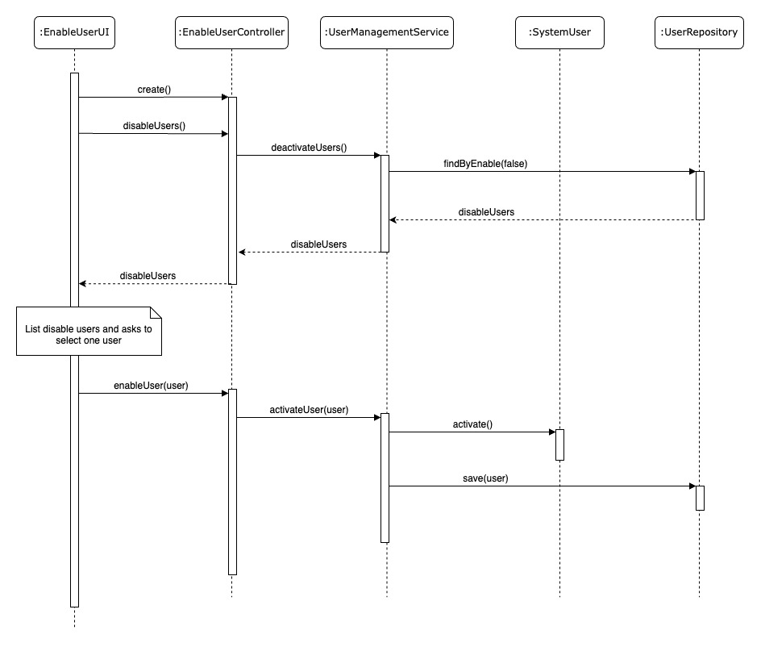
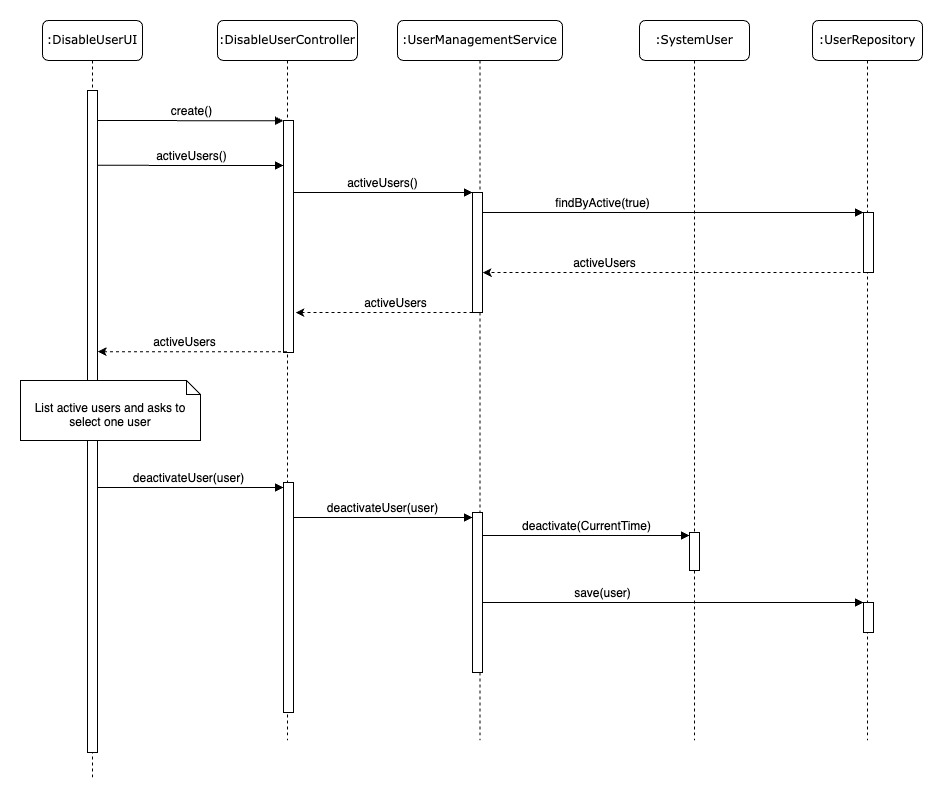

# US 1000b

## 1. Context

This task, identified as "US 1000b", is being assigned for the first time. The context for this task is to manage backoffice users in the system. As an Administrator, the user should be able to disable or enable other backoffice users.

## 2. Requirements

**1000b** As Administrator, I want to be disable/enable users of the backoffice

**Dependencies/References:**

- Alternatively this can be achieved by a bootstrap process

## 3. Analysis

## Client Meeting

- The enable/disable of users is only to control access to the system.

## Business Rules

- When a user is initially created, it is in the enable state.
- This US is directly related to the users of the backoffice.
- To make this change, the user must be of the admin type.
- A user now has an enable or disable state
- This state will be important in the future for the possibility of accessing the system
- It's only possible to disable a user if the user is enabled
- It's only possible to enable a user if the user is disabled

## 4. Design

### 4.1. Realization

#### Enable User

#### Disable User

### 4.2. Class Diagram

#### Enable User

#### Disable User

### 4.3. Applied Patterns

In the development of this task, we utilized several design patterns to structure our code and ensure its maintainability and scalability. These patterns include:  
- **Repository Pattern:** The Repository pattern was used to create an abstraction layer between the data access layer and the business logic layer of the application. This helps to decouple the application and make it easier to maintain and test.  
- **Service Pattern:** The Service pattern was used to encapsulate business logic and rules. This pattern provides a set of methods that any client application can use, and these methods implement the business rules and logic.  
- **Controller Pattern:** The Controller pattern was used in the presentation layer of the application. Controllers handle incoming requests, manipulate data using the model, and select views to render to the user

### 4.4. Tests

#### Case #1: Enable User (existing disable users)

1. Log in as admin
2. Choose the Option User > Enable User
3. Display all the users in disable state
4. Choose a user to update
5. Confirm the update made through List users (User > List Users)

#### Case #2: Enable User (does not exist disable users)

1. Log in as admin
2. Choose the Option User > Enable User
3. Display a message "There are no users to enable"

#### Case #3: Disable User (existing enable users)

1. Log in as admin
2. Choose the Option User > Disable User
3. Display all the users in enable state
4. Choose a user to update
5. Confirm the update made through List users (User > List Users)

#### Case #4: Disable User (does not exist enable users)

1. Log in as admin
2. Choose the Option User > Disable User
3. Display a message "There are no users to disable"

## 5. Implementation
The process of registering a new user in this system involves several components working together. Here's a step-by-step explanation

- **User Interface (EnableUserUI.java/DisableUserUI.java)**: The user interface is responsible for capturing the user's input and displaying the results of the operation. In this case, the user interface will display a list of users and allow the admin to enable or disable them.   
- **Controller (EnableUserController.java/DisableUserController.java):** The controller is responsible for handling incoming requests, processing the data, and returning the response to the user. It acts as an intermediary between the user interface and the service layer. The controller will receive the user's input from the user interface, pass it to the service layer for processing, and return the result to the user interface.  
- **Service (UserManagementService.java):** The service is responsible for implementing the business logic of the application. It contains the methods that perform the actual enable/disable operation on the user. The service layer is where the application's business rules are implemented.
- **Repository (UserRepository):** The repository is responsible for managing the data access layer of the application. It provides an abstraction layer between the application and the database, allowing the application to interact with the database without having to write SQL queries directly.

## 6. Integration/Demonstration

### Integration

We seamlessly integrated our functionality by leveraging an existing service that included a repository. This approach allowed us to efficiently integrate our solution into the system without duplicating efforts or reinventing existing components.
To integrate this functionality two new controllers was created, one for enabling users and another for disabling users. These controllers interact with the UserManagementService, which contains the business logic for enabling and disabling users. The UserManagementService, in turn, interacts with the UserRepository to access and update user data in the database.

### Demonstration

To demonstrate the functionality follow the steps below:

#### Enable User

1. Log in as admin
2. Choose the Option User > Enable User
3. Display all the users in disable state
4. Choose a user to update
5. Confirm the update made through List users (User > List Users)

#### Disable User

1. Log in as admin
2. Choose the Option User > Disable User
3. Display all the users in enable state
4. Choose a user to update
5. Confirm the update made through List users (User > List Users)

This process demonstrates the system's ability to enable and disable users based on their current state. The system should display the appropriate message when there are no users to enable or disable.

## 7. Observations

It's only possible to disable a user if the user is enabled.

It's only possible to enable a user if the user is disabled.