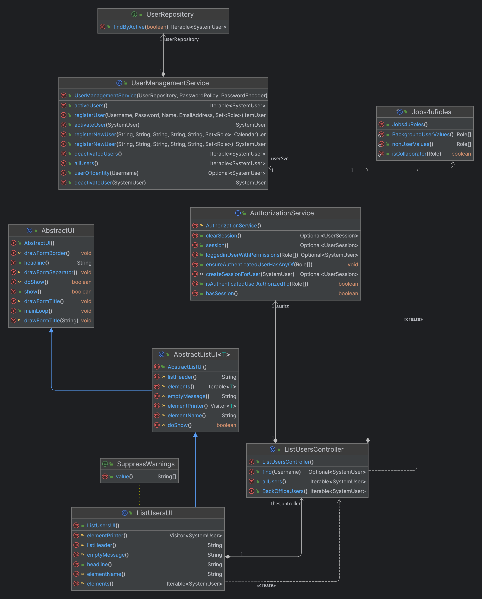
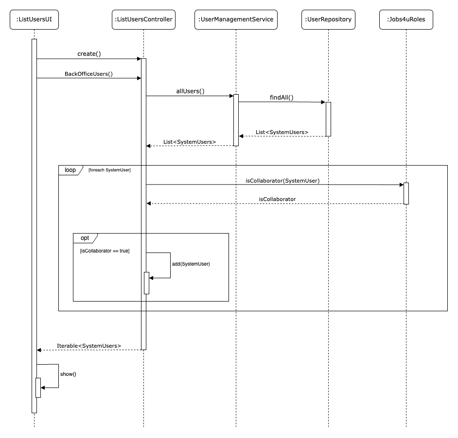

# US 1000c

# 1. Requirements
**1000c** As Administrator, I want to be able to list users of the backoffice.
- Create a new service to list all users of the backoffice.
  

# 2. Analysis

## Business Rules

- This US is directly related to the users of the backoffice.
- To list the backOffice users, the user must be of the admin type.
- The listing of users only shows the users of the backoffice.
- The listing of users must show the user's name, email, and status (enable or disable).

# 3. Design
- To implement this functionality, the team used the Controller and Repository pattern.
- Use the standard base structure of the layered application

## 3.1. Class Diagram

# 3.2. Sequence Diagram

# Test Plan

## Case #1: List User

1. Log in as admin
2. Choose the Option User > List users
3. Display all the users (email, name, status)

## Case #2: List User (does not exist users)

1. Log in as admin
2. Choose the Option User > Enable User
3. Display a message "There are no users to display"

   