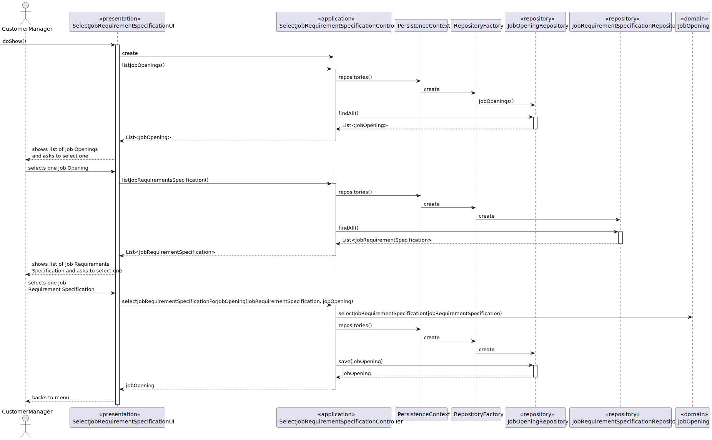
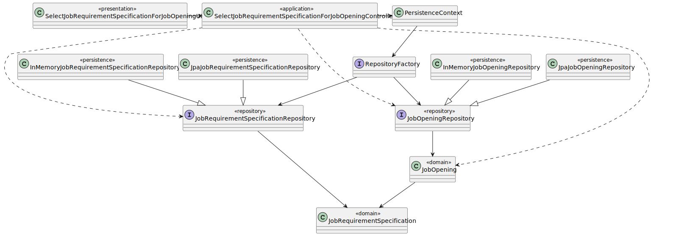

# US 1009

## 1. Context

This task, identified as "US 1009", is being assigned for the first time. The context for this task is to select a Job Requirement Specification for a Job Opening.

## 2. Requirements

**US 1009** As Customer Manager, I want to select the requirements specification to be used
for a job opening.

**Acceptance Criteria:**
- 1009.1. The system should select successfully a Job Requirement Specification for a Job Opening.
- 1009.2. The system should select a valid Job Opening.
- 1009.3. The system should select a valid Job Requirement Specification.

**Dependencies/References:**

- NFR09(LPROG) - Requirement Specifications and Interview Models The support
  for this functionality must follow specific technical requirements, specified in LPROG.
  The ANTLR tool should be used (https://www.antlr.org/).

## 3. Analysis

### Client meeting

-  O Customer manager regista a job opening (US 1002) e de seguida (normalmente) seleciona qual o requirements specification que é adequado a esse job opening. O requirements specification será um dos que foi “criado” pelo language engineer e registado no sistema.

### Business Rules

- This US is directly related to the users of the backoffice.
- To select a Job Requirement Specification for a Job Opening the user must be a customer manager.
- The user must have an email, name, and password.
- The job requirement specification must be identified by a name.
- The job opening must be identified by a job reference.

## 4. Design

### 4.1. Realization



### 4.2. Class Diagram



### 4.3. Applied Patterns

In the development of this task, we utilized several design patterns to structure our code and ensure its
maintainability and scalability. These patterns include:


- **Repository Pattern:** The Repository pattern was used to create an abstraction layer between the data access layer
  and the business logic layer of the application. This helps to decouple the application and make it easier to maintain
  and test.
- **Controller Pattern:** The Controller pattern was used in the presentation layer of the application. Controllers
  handle incoming requests, manipulate data using the model, and select views to render to the user

### 4.4. Tests

**Test 1:** *Verifies that is possible to select a Job Requirement Specification to a Job Opening*

**Refers to Acceptance Criteria:** 1009.1

```
@Test(expected = success)
public void ensurePossibleToSelectAJobRequirementSpecificationForAJobOpening() {
        JobOpening jobOpening = new JobOpening(...);
        JobRequirementSpecification jobRequirementSpecification = new JobRequirementSpecification(...);
        jobOpening.selectJobRequirementSpecification(jobRequirementSpecification);
}
```

**Test 1:** *Verifies that it is not possible to select a Job Requirement Specification to a invalid Job Opening*

**Refers to Acceptance Criteria:** 1009.2


```
@Test(expected = NullPointerException.class)
public void ensureNotPossibleToSelectAJobRequirementSpecificationForAInvalidJobOpening() {
	JobOpening jobOpening = null;
	JobRequirementSpecification jobRequirementSpecification = new JobRequirementSpecification(...);
	jobOpening.selectJobRequirementSpecification(jobRequirementSpecification);
}
````

**Test 2:** *Verifies that is not possible to select a invalid Job Requirement Specification to a Job Opening*

**Refers to Acceptance Criteria:** 1009.3

```
@Test(expected = IllegalArgumentException.class)
public void ensureNotPossibleToSelectAInvalidJobRequirementSpecificationForAJobOpening()
    JobOpening jobOpening = new JobOpening(...);
    JobRequirementSpecification = null;
    jobOpening.selectJobRequirementSpecification(jobRequirementSpecification);
}
```

## 5. Implementation

The process of selecting a Job Requirement Specification for a Job Opening in this system involves several components working together. Here's a step-by-step
explanation

- **User Interface (SelectJobRequirementSpecificationUI.java)**: The process starts in the SelectJobRequirementSpecificationUI class, which is
  responsible for interacting
  with the user. It prompts the user to enter the necessary information.
  This class uses the SelectJobRequirementSpecificationController to handle the business logic.
- **Controller (SelectJobRequirementSpecificationController.java):** The SelectJobRequirementSpecificationController class is the bridge between the
  UI and the business
  logic.
- **Repository (JobOpeningRepository):** The JobOpeningRepository is an interface that defines the methods for
  interacting with the
  database. It extends the DomainRepository interface, which provides methods for basic CRUD operations.
- **Repository (JobRequirementSpecificationRepository):** The JobRequirementSpecificationRepository is an interface that defines the methods for
  interacting with the
  database. It extends the DomainRepository interface, which provides methods for basic CRUD operations.

## 6. Integration/Demonstration

### Integration

We seamlessly integrated our functionality by leveraging an existing service that included both a repository and a
controller. This approach allowed us to efficiently integrate our solution into the system without duplicating efforts
or reinventing existing components.

### Demonstration

To demonstrate the functionality follow the steps below:

1. Start the application and log in as a customer manager.
2. Navigate to the job openings section and select the option to select a Job Requirement Specification for a Job Opening.
3. Select the Job Opening.
4. Select the Job Requirement Specification.

## 7. Observations

- Nothing to add.