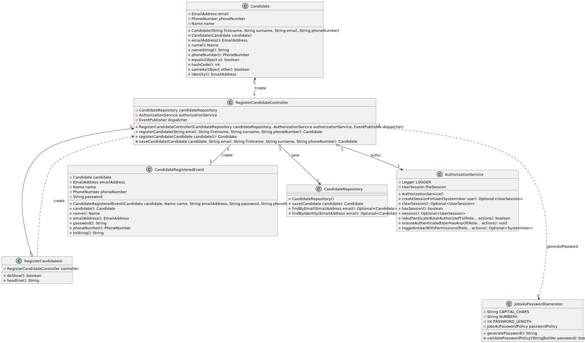

# US 2000a

## 1. Context

This task, identified as "US 2000a", is being assigned for the first time. The context for this task is to register manually a Candidate.

## 2. Requirements

**US 2000a** As Operator, I want to register a candidate

**Acceptance Criteria:**
- 1. The system should register a candidate successfully.
- 2. The system should register a candidate with valid information.

**Dependencies/References:**

- N/A

## 3. Analysis

### Client meeting

-  No âmbito da US 2000a o Operator cria utilizadores do sistema para candidatos que ainda não estejam no sistema. Tem de fazer isso com base nos dados recebidos na candidatura (que incluem email e nome). O email servirá para identificar a pessoa. Neste contexto é necessário ter uma password para esse novo utilizador. Uma vez que essa informação não é transmitida pelo candidato, suponho que a solução mais “aconselhada” será o sistema gerar uma password para esse utilizador. Como o utilizador/candidato irá receber essa informação (a forma de autenticação na app) está out of scope, no sentido em que não existe nenhuma US que remete para isso.
-  A US2000a refere-se a uma funcionalidade do Operador, manualmente, registar candidatos.

### Business Rules

- This US is directly related to the users of the backoffice.
- To register a candidate the user must be an operator.
- The user must have an email, name, phone number, and password.
- The candidate must be identified by an email.

## 4. Design

### 4.1. Realization

### 4.2. Class Diagram

### 4.3. Applied Patterns

In the development of this task, we utilized several design patterns to structure our code and ensure its
maintainability and scalability. These patterns include:

- **Repository Pattern:** The Repository pattern was used to create an abstraction layer between the data access layer
  and the business logic layer of the application. This helps to decouple the application and make it easier to maintain
  and test.
- **Controller Pattern:** The Controller pattern was used in the application layer of the application. Controllers
  handle incoming requests, manipulate data using the model, and select views to render to the user

### 4.4. Tests

**Test 1:** *Verifies that candidates are properly registered*

**Test 2:** *Verifies that is not possible to register a candidate with invalid information*

**Test 3:** *Verifies that is not possible to register a candidate with an existing email*

## 5. Implementation

The process of selecting a Job Requirement Specification for a Job Opening in this system involves several components working together. Here's a step-by-step
explanation

- **User Interface (RegisterCandidateUI.java)**: The process starts in the RegisterCandidateUI class, which is responsible for interacting with the operator. It prompts the operator to enter the candidate's information. This class uses the RegisterCandidateController to handle the business logic.
- **Controller (RegsiterCandidateController.java):** The RegisterCandidateController class is the bridge between the UI and the business logic. It communicates with the CandidateRepository to register the candidates.
- **Repository (CandidateRepository):** The CandidateRepository is an interface that defines the methods for interacting with the database. It extends the DomainRepository interface, which provides methods for basic CRUD operations.

## 6. Integration/Demonstration

### Integration

We seamlessly integrated our functionality by leveraging an existing service that included both a repository and a
controller. This approach allowed us to efficiently integrate our solution into the system without duplicating efforts
or reinventing existing components.

### Demonstration

To demonstrate the functionality follow the steps below:

1. Start the application and log in as an operator.
2. Navigate to the Candidate Menu.
3. Select the Register Candidate option.
4. Submit the candidate data with the correct values.

## 7. Observations

- Nothing to add.