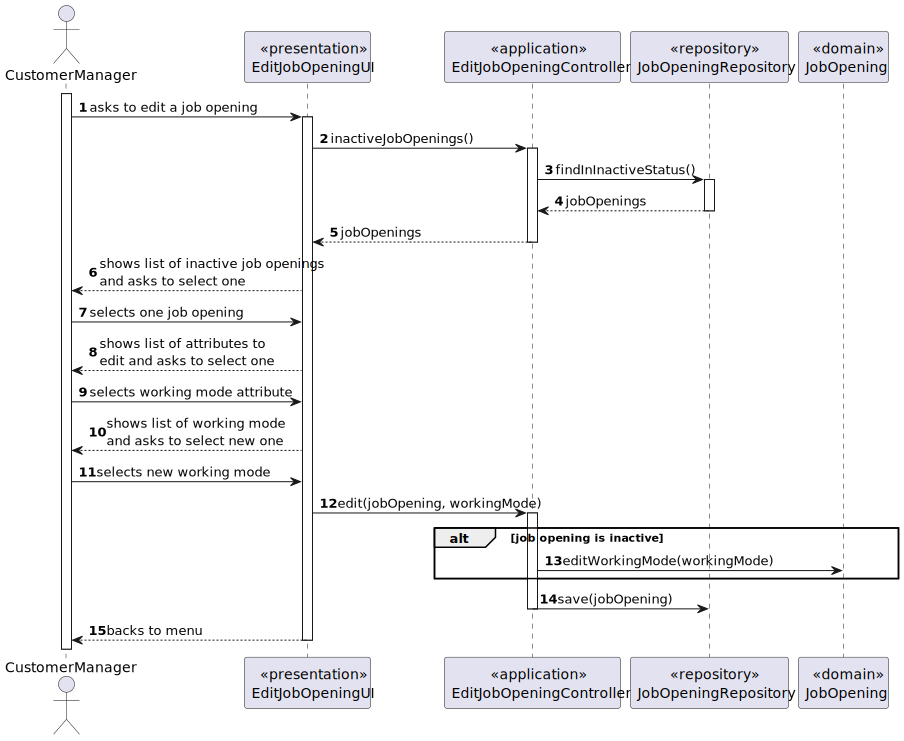
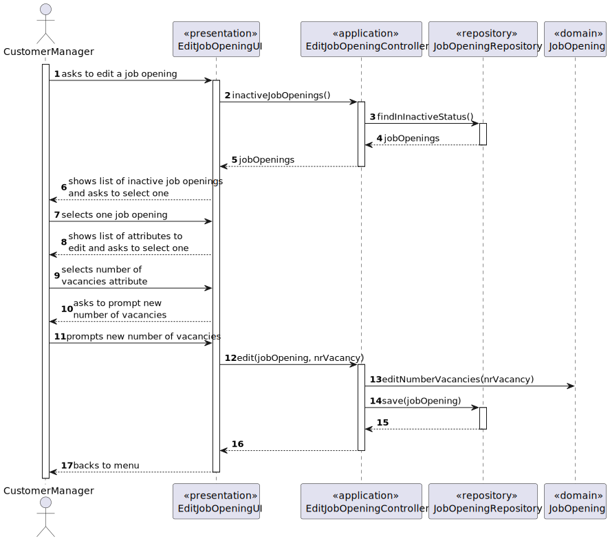
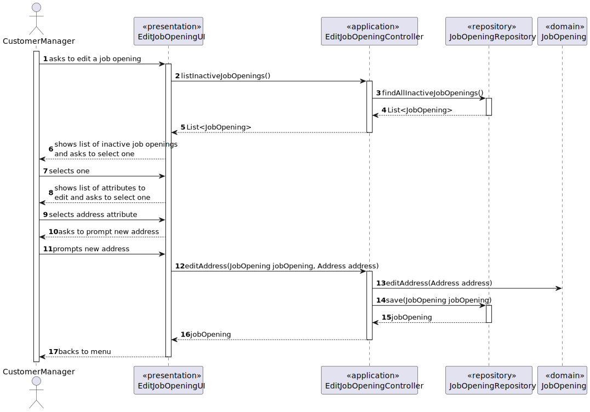
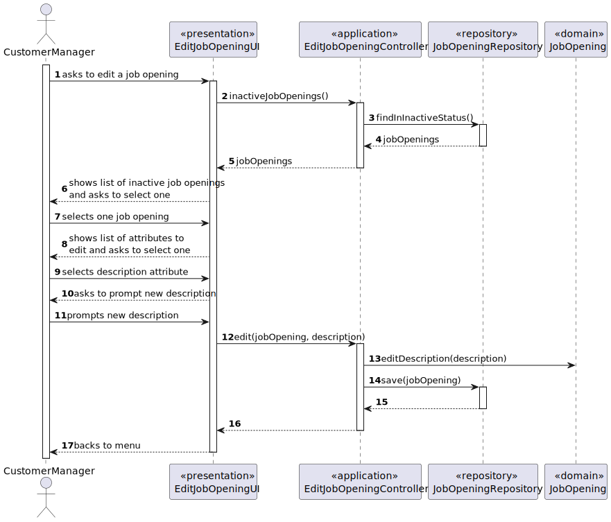
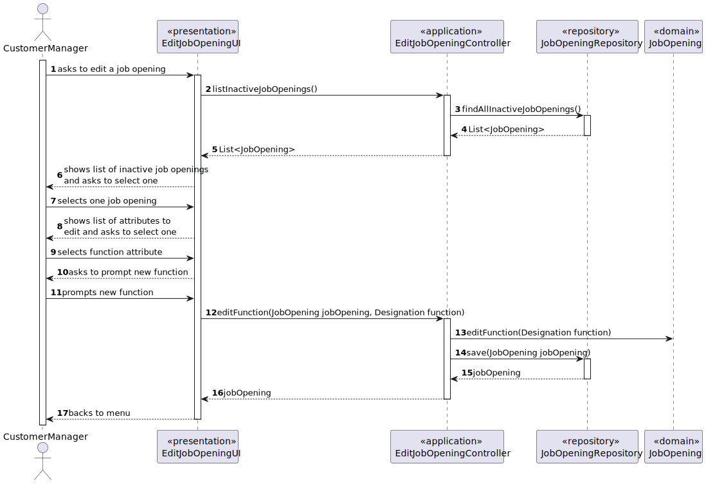
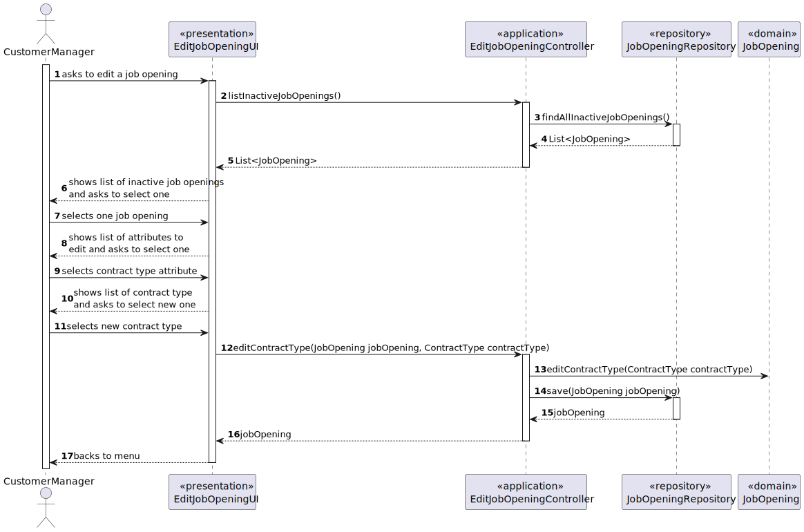
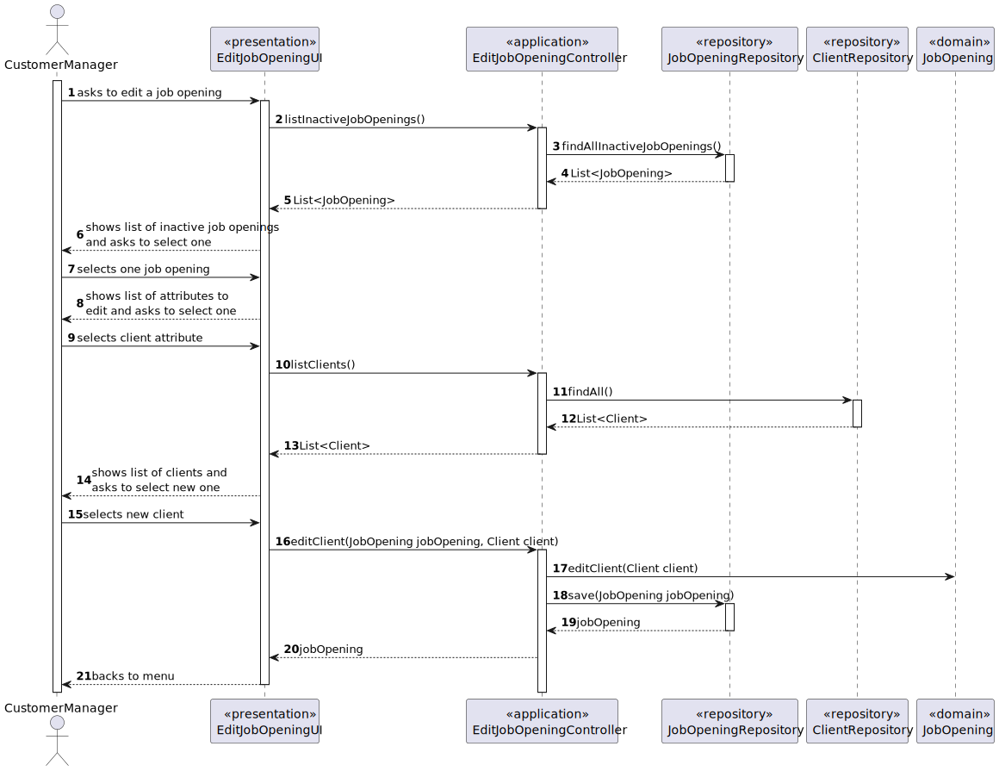

# Design

## Realization

### Edit working mode of a job opening

### Edit number of vacancies of a job opening

### Edit address of a job opening

### Edit description of a job opening

### Edit function of a job opening

### Edit contract type of a job opening

### Edit client of a job opening

### Domain Classes

- JobOpening

### Controller

- EditJobOpeningController - For editting a job opening.

### Service

- AuthenticationService

### Repository

- JobOpeningRepository
- ClientRepository (for editing a client)

