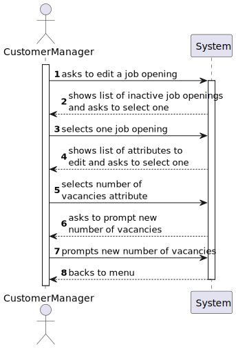
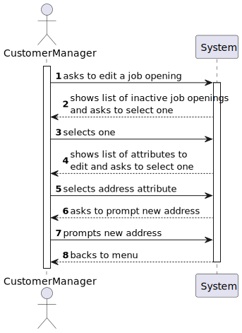
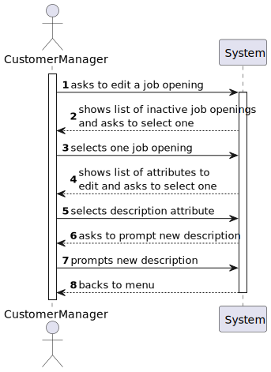
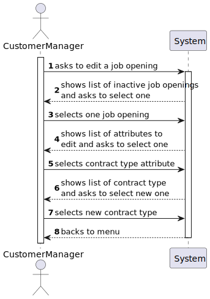

# US 1004

## 1. Context

This task, identifies as "US 1004", is part of the Customer Manager feature. The goal of this task is to allow the customer manager to edit job opening information.

This is the first task that is directly related to the rank feature of the system.

## 2. Requirements

**1004** As Customer Manager, I want to edit a job opening.

**Dependencies/References:**

This user story have some dependencies with the following user stories:

| US                                     | Reason                                            |
|----------------------------------------|---------------------------------------------------|
| [1002](../../SprintB/us1002/readme.md) | The job opening must be registered in the system. |

## 3. Analysis

- **The customer manager, after registering the job opening, is able to edit its information.**

### 3.1. Client meeting

**Question:**

- No seguimento da US 1004 para permitir editar um job opening, estamos a assumir que é permitido alterar: Nº de vagas; Morada; Contract Type('FULL_TIME', 'PART_TIME'); Mode ('ON_SITE','REMOTE'); Description; Funcao. Estamos na linha de raciocício correta, ou é necessário alterar a lista para incluir outra informação adicional ou suprimir alguma desta lista?

**Answer:**

- Do meu ponto de vista deve ser possível alterar “tudo” exceto o próprio job reference.

**Question:**

- Em quais ou até que fases de recrutamento de um Job Opening em que pode-se editar as informações dela?

**Answer:**

- As alterações devem ser compatíveis com o “momento” em que estamos nessa job opening. Por exemplo, não faz sentido alterar o contrat type se já estamos a receber candidaturas. Essas candidaturas foram feitas segundo uma descrição da oferta de emprego e não faz sentido estar a alterar depois de as pessoas se candidatarem. Mas, por exemplo, deve ser possível alterar o job requirements specification (refere-se a outra US) enquanto as pessoas se candidatam, pois é um aspeto técnico, que não é do conhecimento público.

**Question:**

- A cada edição feita de alguma informação numa Job Opening, é necessário registar a data e a hora da edição, tal como acontece no momento de registar a Job Opening?

**Answer:**

- É comum haver um registo do utilizador que criou ou fez a última atualização de um “registo” no sistema.

### 3.2. Business Rules

- The customer manager must select only one job opening to edit at a time.
- The customer manager can only edit information about a job opening that was previously registered in the process of registering the job opening (working mode, number of vacancies, address, description, function, type of contract and client), with the exception of the job reference.
- The customer manager can edit one job opening information at a time.
- The customer manager cannot edit a job opening when it is in the active state (after entering the Application phase).

### 3.3. System functionality

#### 3.3.1. Edit working mode of a job opening


#### 3.3.2. Edit number of vacancies of a job opening



#### 3.3.3. Edit address of a job opening



#### 3.3.4. Edit description of a job opening



#### 3.3.5. Edit function of a job opening


#### 3.3.6. Edit contract type of a job opening



#### 3.3.7. Edit client of a job opening


## 4. Design

### 4.1. Realization

#### 4.1.1. Edit working mode of a job opening


#### 4.1.2. Edit number of vacancies of a job opening


#### 4.1.3. Edit address of a job opening


#### 4.1.4. Edit description of a job opening


#### 4.1.5. Edit function of a job opening


#### 4.1.6. Edit contract type of a job opening


#### 4.1.4. Edit client of a job opening


### 4.2. Applied Patterns

In the development of this task, we utilized several design patterns to structure our code and ensure its
maintainability and scalability. These patterns include:

- **Repository Pattern:** The Repository pattern was used to create an abstraction layer between the data access layer
  and the business logic layer of the application. This helps to decouple the application and make it easier to maintain
  and test.
- **Controller Pattern:** The Controller pattern was used in the presentation layer of the application. Controllers
  handle incoming requests, manipulate data using the model, and select views to render to the user.

### 4.3. Tests

**In this case, tests are implemented for Business Rule nº 4**

#### 4.3.1. Edit working mode

```
void ensureEditingWorkingModeIsSuccessfullWhenJobOpeningIsInative() (expected = success) {
  JobOpening jobOpening = new JobOpening(...); // For default, status is inactive
  jobOpening.editWorkingMode(workingMode);
  }
```
```
void ensureEditingWorkingModeFailsWhenJobOpeningIsActive() (expected = IllegalArgumentException.class) {
  JobOpening jobOpening = new JobOpening(...);
  jobOpening.status = JobOpeningStatus.ACTIVE;
  jobOpening.editWorkingMode(workingMode);
  }
```

#### 4.3.2. Edit number of vacancies

```
void ensureEditingNumberOfVacanciesIsSuccessfullWhenJobOpeningIsInative() (expected = success) {
  JobOpening jobOpening = new JobOpening(...); // For default, status is inactive
  jobOpening.editNumberOfVacancies(nrVacancy);
  }
```
```
void ensureEditingNumberOfVacanciesFailsWhenJobOpeningIsActive() (expected = IllegalArgumentException.class) {
  JobOpening jobOpening = new JobOpening(...);
  jobOpening.status = JobOpeningStatus.ACTIVE;
  jobOpening.editNumberOfVacancies(nrVacancy);
  }
```

#### 4.3.3. Edit address

```
void ensureEditingAddressIsSuccessfullWhenJobOpeningIsInative() (expected = success) {
  JobOpening jobOpening = new JobOpening(...); // For default, status is inactive
  jobOpening.editAddress(address);
  }
```
```
void ensureEditingAddressFailsWhenJobOpeningIsActive() (expected = IllegalArgumentException.class) {
  JobOpening jobOpening = new JobOpening(...);
  jobOpening.status = JobOpeningStatus.ACTIVE;
  jobOpening.editAddress(address);
  }
```

#### 4.3.4. Edit description

```
void ensureEditingDescriptionIsSuccessfullWhenJobOpeningIsInative() (expected = success) {
  JobOpening jobOpening = new JobOpening(...); // For default, status is inactive
  jobOpening.editDescription(description);
  }
```
```
void ensureEditingDescriptionFailsWhenJobOpeningIsActive() (expected = IllegalArgumentException.class) {
  JobOpening jobOpening = new JobOpening(...);
  jobOpening.status = JobOpeningStatus.ACTIVE;
  jobOpening.editDescription(description);
  }
```

#### 4.3.5. Edit function

```
void ensureEditingFunctionIsSuccessfullWhenJobOpeningIsInative() (expected = success) {
  JobOpening jobOpening = new JobOpening(...); // For default, status is inactive
  jobOpening.editFunction(function);
  }
```
```
void ensureEditingFunctionFailsWhenJobOpeningIsActive() (expected = IllegalArgumentException.class) {
  JobOpening jobOpening = new JobOpening(...);
  jobOpening.status = JobOpeningStatus.ACTIVE;
  jobOpening.editFunction(function);
  }
```

#### 4.3.6. Edit contract type

```
void ensureEditingContractTypeIsSuccessfullWhenJobOpeningIsInative() (expected = success) {
  JobOpening jobOpening = new JobOpening(...); // For default, status is inactive
  jobOpening.editContractType(contractType);
  }
```
```
void ensureEditingContractTypeFailsWhenJobOpeningIsActive() (expected = IllegalArgumentException.class) {
  JobOpening jobOpening = new JobOpening(...);
  jobOpening.status = JobOpeningStatus.ACTIVE;
  jobOpening.editContractType(contractType);
  }
```

## 5. Implementation

The process of editing a Job Opening in this system involves several components working together. Here's a step-by-step
explanation

- **User Interface (EditJobOpeningUI.java)**: The process starts in the EditJobOpeningUI class, which is
  responsible for interacting
  with the user. It prompts the user to enter the necessary information.
  This class uses the EditJobOpeningController to handle the business logic.
- **Controller (EditJobOpeningController.java):** The EditJobOpeningController class is the bridge between the
  UI and the business
  logic.
- **Repository (JobOpeningRepository):** The JobOpeningRepository is an interface that defines the methods for
  interacting with the
  database. It extends the DomainRepository interface, which provides methods for basic CRUD operations.

## 6. Demonstration

To demonstrate this functionality follow the steps below:

### 6.1. Editing working mode of a job opening

1. Start the application and log in as a customer manager.
2. Navigate to the job openings section and select the option to select a edit a Job Opening.
3. Select the Job Opening.
4. Select the working mode attribute to edit.
5. Select the new working mode.

### 6.2. Editing number of vacancies of a job opening

1. Start the application and log in as a customer manager.
2. Navigate to the job openings section and select the option to select a edit a Job Opening.
3. Select the Job Opening.
4. Select the number of vacancies attribute to edit.
5. Input the new working mode.

### 6.3. Editing address of a job opening

1. Start the application and log in as a customer manager.
2. Navigate to the job openings section and select the option to select a edit a Job Opening.
3. Select the Job Opening.
4. Select the address attribute to edit.
5. Input the new address.

### 6.4. Editing description of a job opening

1. Start the application and log in as a customer manager.
2. Navigate to the job openings section and select the option to select a edit a Job Opening.
3. Select the Job Opening.
4. Select the description attribute to edit.
5. Input the new description.

### 6.5. Editing function of a job opening

1. Start the application and log in as a customer manager.
2. Navigate to the job openings section and select the option to select a edit a Job Opening.
3. Select the Job Opening.
4. Select the function attribute to edit.
5. Input the new function.

### 6.6. Editing contract type of a job opening

1. Start the application and log in as a customer manager.
2. Navigate to the job openings section and select the option to select a edit a Job Opening.
3. Select the Job Opening.
4. Select the contract type attribute to edit.
5. Select the new contract type.