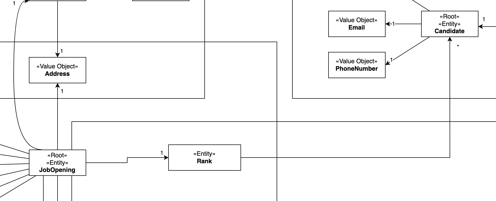
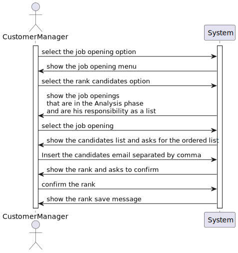
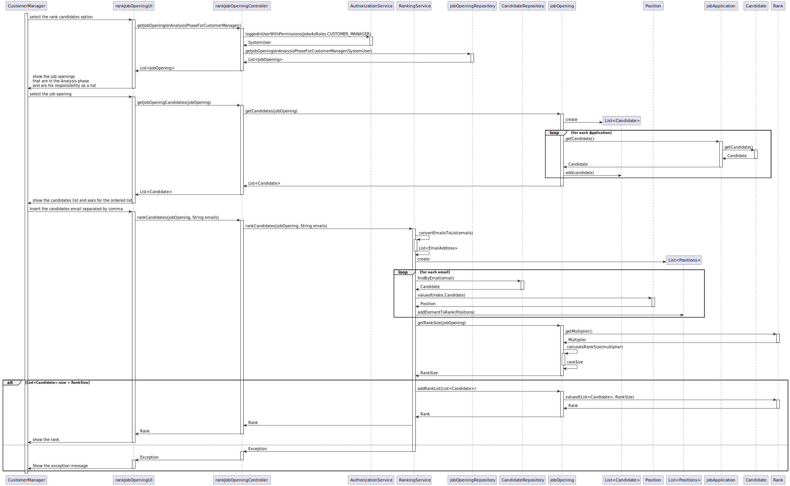

# US 1013 - As Customer Manager, I want to rank the candidates for a job opening.

## 1. Context

This task, identified as "US 1013", is part of the Customer Manager feature. The goal of this task is to allow the customer manager to rank the candidates for a job opening.

This is the first task that is directly related to the rank feature of the system.

## 2. Requirements

**1013** As Customer Manager, I want to rank the candidates for a job opening.

**Dependencies/References:**

This user story have some dependencies with the following user stories:

| US                                                                                                          | Reason                                                                                                                                          |
|-------------------------------------------------------------------------------------------------------------|-------------------------------------------------------------------------------------------------------------------------------------------------|
| [G007](../../SprintB/g007/readme.md)                                                                        | Whe need the authentication to ensure is a customer manager that is logged                                                                      |
| [1002](../../SprintB/us1002/readme.md)                                                                      | Each Job Opening has its rank, so we need jobOpening in the system                                                                              |
| [2000a](../../SprintB/us2000a/readme.md)                                                                    | The rank is related to candidate,so we need to create candidates                                                                                |
| [2002](../../SprintB/us2002/readme.md)                                                                      | This us is responsible for adding applications in the system, that are associated to job openings                                               |
| [1007](../../SprintB/us1007)                                                                                | This US is responsible for creating the phases of a job opening. Since ranking can only be done in the 'Analysis' phase, these USs are related. |
| [1009](../../SprintB/us1009/readme.md) [1011](../../SprintB/us1011/readme.md) [1012](../../SprintB) | To rank the candidate, the customer manager analyse the requirements and the interviews of the job Opening                                      |

## 3. Analysis

### What is asked?

The customer manager after [analyzing](#analise) the applications for a job Opening, should be able to [rank](#rank) the candidates. 

To rank the candidates, the customer should [order](#order) the candidates by preference, being the first candidate the one that the customer manager thinks is the best for the job opening.

This process can only be done in the Analysis phase of the job opening.

The customer manager should be able to edit the ranking if none of the interested parties were yet notified of the results.

In the end of the analysis phase, the customer manager should have fill the rank list. Cant exist a rank position without a candidate.

#### 1. How the order of the rank works? 

- The rank order represents the preference of the customer manager for the candidates.
- The first element of the rank is the candidate that the customer manager thinks is the best for the job opening, and the second element is the second best, and so on.
- There aren't two candidates with the same rank.

#### 2. How the analysis of candidates is done?

- During the recruitment process, in the phase of Analysis, the applications 
are analyzed and the customer manager can rank the candidates. 
The analysis is done considering all available information like interviews, 
curriculum, requirements answer and all files imported from [File Bot](../../SprintB/us2002/readme.md).

#### 3. How is the ranking done?

This approach is an idea from the client, after talking to him, he suggested that approach that our team gave priority.

- The ranking is made ordering the candidates separated by a comma, similar to the way people enter recipients for an email. 
The customer manager should write the candidates email to identify the candidates.

  - Example:
    - candidate1@gmail.com,candidate2@gmail.com,candidate3@gmail.com

- The candidates that are not in the list are considered not ranked.

- The customer manager can leave the ranking process and complete later, but the system should show a message to the customer manager asking if he wants to leave the ranking process and complete later.

- The rank size list is the same as the number of vacancies plus a configurable multiplier, which determines the number of candidates to be in the ranking. (example: if the job opening has 3 vacancies and the multiplier is 2, the rank size list is 6).

### Domain model

To implement this user story some changes are needed in the domain model.

- A new Entity is needed to represent the rank of a candidate in a job opening.
- The Rank is inside of Job Opening aggregate. Each Job Opening can have zero or one rank (The rank only exists in the Analysis phase), and each rank has zero or multiple Candidates.

### Doubts to the client

  - Rank the candidates for a job Opening is the same as rank the job Applications for a Job Opening, knowing that I can only know the candidates throw the job application? 

    > **Answer:** In the context of a job opening, a candidate is someone that made an application to that job opening. But the same person can be a candidate to other job openings.
    

  - How is the ranking done? The customer manager selects a job opening and is shown the different candidates, and they assign a rank to each one. And the ranking process end when he assigns a rank to all candidates?

        Example: 
                - Rank the candidate1:
                - Write the rank: 3
            
                - Rank the candidate2:
                - Write the rank: 1 
            
                - Rank the candidate3:
                - Write the rank: 4

    >  **Answer:** Once again, I do not have specific requirements for UI/UX. But I can provide some ideas. Being a console application limits the UI/UX. However, I see this functionality similar to the way people enter recipients for an email, for instance. In the case of the recipients of an email I simply write their emails separated by a comma. Could it be similar in this case?

  - When a customer manager starts the ranking process, he can stop and continue later? Or the ranking process must be done in one go?  
    >  **Answer:** I guess it may depend on how you implement the solution. But, in the case it may work as a “long operation” be aware of when and how to conclude the “operation”.
  - The customer manager can change the rank of a candidate after assigning it?
    >  **Answer:** That should be possible if none of the interested parties were yet notified of the results.

  - When the analysis phase ends, the ranking need to have all the candidates? or can the customer manager rank only some of the candidates?
    >  **Answer:** All the candidates should be ranked before moving to the result phase.
  
  - When the customer manager is ranking the candidates, in terms of UI, should we display information from the application such as interview score, etc... or just the candidate's name and email?
    > **Answer:** As stated before, I do not have specific requirements for the UI/UX. Use best practices. However, I would like it to be possible for the Customer Manager to have 2 or more instances of the application running, so that he/she could, for instance, see the interviews grades and, at the same time, register the order/ranking of the candidates.

### Client Clarifications
These clarifications were made with the client to better understand the requirements of the user story. All questions and aswers are available in this [file](https://myisepipp-my.sharepoint.com/:w:/g/personal/atb_isep_ipp_pt/EUuTReNeiM1NorupBbiS9hQB38kUh5TPLca7uDYEitSeZg?e=I5ymVX).

- The order of the rank is responsibility of the Customer Manager.
- The fact that there are no interviews does not affect the ranking of the candidates because the ranking does not depend explicitly on the interviews.
- The ranking is a decision of the Customer Manager based on all the data that he/she may have during the process
- The ranking of candidates is the responsibility of the customer manager. They may base it on interview results and other information, but the ranking is not automatic. There is no score or scale to use. The applications are simply ordered.
- The client see this functionality similar to the way people enter recipients for an email, for instance. In the case of the recipients of an email I simply write their emails separated by a comma.
- It may work as a “long operation” be aware of when and how to conclude the “operation”.
- The customer manager should be able to edit the ranking if none of the interested parties were yet notified of the results.
- All the candidates should be ranked before moving to the result phase.
- To avoid recording in the system a lot of details that will not have any impact (a lot candidates in ranking, just the first ones are important), the client suggests that the ranking size is limited to a configurable number based on the number of vacancies, ensuring that only the most relevant candidates are ranked. This configurable number can be adjusted using a global property that determines the extent of the ranking beyond the vacancy number.

### How is supposed to work?

To rank the candidates of one job opening should follow the next steps:

1. The user should be logged in as a Customer Manager.
2. The customer manager selects the Job Opening option, and then one option to rank candidates
3. The system will show to the customer manager all the job openings that are in the Analysis phase and are his responsibility.
4. The customer manager selects the job opening that he wants to rank the candidates.
5. A list of the candidates are shown to the customer manager. And the system wait for his ordered list.
6. The customer manager writes the candidates email separated by a comma, in the order that he wants to rank the candidates.
7. The system shows the rank and asks if the customer manager wants to save.
8. The system saves the rank of the candidates.

> - If the customer didn't rank all the candidates, the system should show a message to the customer manager asking if he wants to leave the ranking process and complete later.
> 
> - The customer manager can edit the rank of the candidates if none of the interested parties were yet notified of the results.
>
> - If the customer manager add too many candidates in the rank, the system should show a message to the customer manager, asking to delete candidates.

### SSD

### Dependencies to other user stories
- [Dependencies table](#dependencias)

### Impact in the business

- After ranking is done, the customer can access to the list of candidates in the order that the customer manager thinks is the best for the job opening. This can be a good way to help the customer to select the best candidate for the job opening.

## 4. Design

### 4.1. Realization

### 4.2. Class Diagram

### 4.3. Applied Patterns

- **Repository Pattern:** Repository Pattern is an essential for managing data access in a way that promotes clean separation of concerns, flexibility, and testability.

- **Service Pattern:** The Service Pattern is an essential for organizing business logic in a scalable, maintainable, and reusable way. By implementing a service layer, applications can achieve a clean separation of concerns, making them easier to develop, test, and maintain.

- **Controller Pattern:** Is essential for managing the interaction between the user interface and the business logic of an application. By clearly separating concerns into models, views, and controllers, applications become more modular, easier to develop, test, and maintain.

### 4.4. Tests

#### 4.4.1. Unit Tests

##### Rank Class
- **Test 1:** Test set rank only works with rankSize set first
- **Test 2:** Test create a rank with a list of candidates
- **Test 3:** Test create a rank with a list of candidates with a size bigger than the rank size list 
- **Test 4:** Test create a rank with a list of candidates with a size smaller than the rank size list
- **Test 5:** Test the ToString method 

#### 4.4.2. Integration Tests

- **Test 1:** Test adding a candidate that doest exist
- **Test 2:** Test adding a candidate that exist but didn't applied for that jobOpening
- **Test 3:** Test adding a candidate that exist and applied for that jobOpening
- **Test 4:** Test writing a rank with invalid emails
- **Test 5:** Test writing a rank with valid separator
- **Test 6:** Test writing a rank correctly

## 5. Implementation

For the implementation of this user story, we need to create some components, that work together:

- **User Interface (rankJobOpeningUI.java):** This component is resposible for the interaction with the user. It shows the job openings that are in the Analysis phase and are the responsibility of the customer manager. It also shows the list of candidates that applied for the job opening and waits for the customer manager to write the rank of the candidates. 

- **Controller (rankJobOpeningController.java):** The rankJobOpeningController class is responsible for handling the user input and calling the appropriate service methods to rank the candidates. It receives the job opening and the list of candidates from the UI and passes them to the service layer for processing. It also handles the response from the service layer and send the response back to the UI.

- **Service (RankingService.java):** The RankingService class is responsible for implementing the business logic for ranking the candidates. It receives the job opening and the list of candidates from the controller and creates a new Rank object with the list of candidates. It then saves the Rank object to the database using the JobOpeningRepository. It also checks if the rank size list is exceeded and throw exception if necessary.

- **Repository (JobOpeningRepository):** The JobOpeningRepository class is responsible for managing the persistence of the Rank objects. It provides methods for saving, updating, and retrieving Rank objects from the database.

## 6. Integration/Demonstration

### Integration

To integrate the components, we need used some components that already exist in the system, like repositories the jobOpening and JobApplication classes.
The integration of this components with the new components was clear and easy to do, because the new components are very simple and don't have a lot of dependencies.

### Demonstration

To demonstrate the implementation of this user story, we can use the following steps:
1. Login as a Customer Manager
2. Select the Rank option
3. Select the Register Rank for Job Opening option
4. The system will show the job openings that are in the Analysis phase and are the responsibility of the customer manager, and the customer manager selects the job opening that he wants to rank the candidates.
5. The system will show the list of candidates that applied for the job opening, and the customer manager writes the email of the candidates separated by a comma.
   6. In case of ranking candidates from a jobOpening that already has a rank, the system displays the current rank to the customer manager, and asks for the new rank.
6. The system shows the rank inserted

## 7. Observations

In case of register a ranking for a jobOpening that already has a ranking, the system displays to the customer manager the current ranking.
