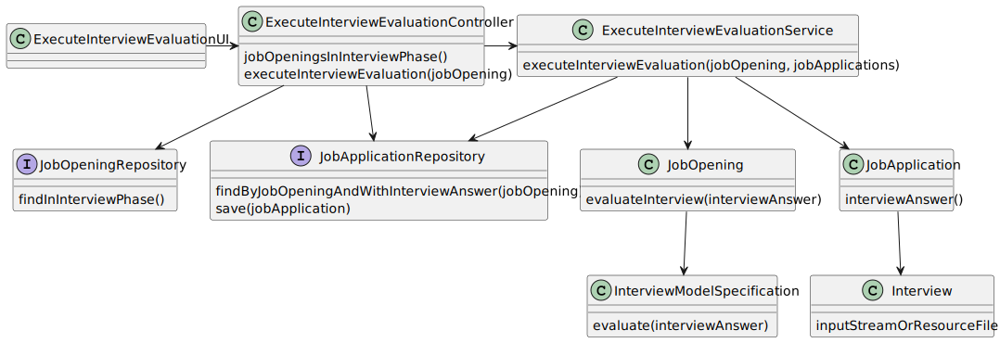

# Design

## Functionality

## Domain classes

- JobOpening
- JobApplication
- InterviewModelSpecification
- Interview

## Controller

- ExecuteInterviewEvaluationController

## Service

- ExecuteInterviewEvaluationService

## Repository

- JobOpeningRepository
- JobApplicationRepository

## Class diagram

