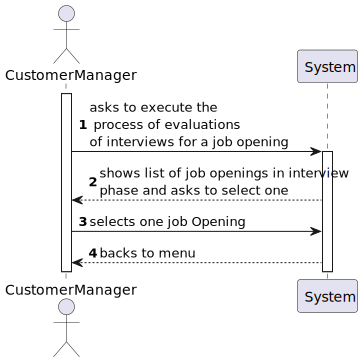

# US 1018

## 1. Context

This task, identifies as "US 1018", is part of the Customer Manager feature. The goal of this task is to allow the customer manager to execute the process of evaluation the interviews for a job opening.

## 2. Requirements

**1018** As Customer Manager, I want to execute the process that evaluates (grades) the
interviews for a job opening.

**Dependencies/References:**

This user story have some dependencies with the following user stories:

| US                                     | Reason                                                                                        |
|----------------------------------------|-----------------------------------------------------------------------------------------------|
| [1011](../../SprintB/us1011/readme.md) | The job opening must have a interview model made for evaluation.                              |
| [1017](../../SprintC/us1017/readme.md) | The job application of a job opening has an interview answer settled (not necessary for all). |

## 3. Analysis

- **The customer manager is able to execute the process of evaluation of interviews for a Job Opening.**

### 3.1. Client meeting

**Question (captured from US 1015):**

-  Deve ser executado o processo para todos os candidatos ou apenas para alguns (segundo algum critério)?

**Answer:**

-  Os ficheiros com as respostas aos requisitos vão entrando no sistema gradualmente. Talvez seja mais “simples” que o processo execute (ou seja, faça a verificação dos requisitos) para os candidatos para os quais já foi submetido o ficheiro de requisitos. Nalgum momento o processo irá executar com todos os candidatos já com os ficheiros de requisitos submetidos.

**Question:**

- No caso de upload de um ficheiro, se a pergunta que requer um número como resposta for preenchida com um formato inválido, por exemplo, uma letra, devemos considerar isso como um formato inválido na US 1017 (e pedir para o user voltar a dar upload a um ficheiro válido) ou devemos, na US1018, considerar que está incorreta e atribuir 0 pontos automaticamente para essa resposta inválida? Isto é, na US 1017, devemos apenas verificar o formato do ficheiro ou devemos verificar também se as respostas são preenchidas com o tipo de dados correto?

**Answer:**

- O caso mencionado deve ser considerado um erro de validação do ficheiro (ou seja, o ficheiro submetido não corresponde à gramática definida).

### 3.2. Business rules

- The job opening must be in interview phase.
- The process of execution of evaluation of interviews is only made in job applications with interview answers but without interview points.
- The evaluation of each interview must result in a value in a number with a range of 0-100 and is automatically settled on each job application.

### 3.3. System functionality

