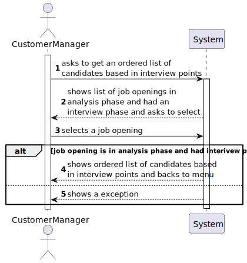
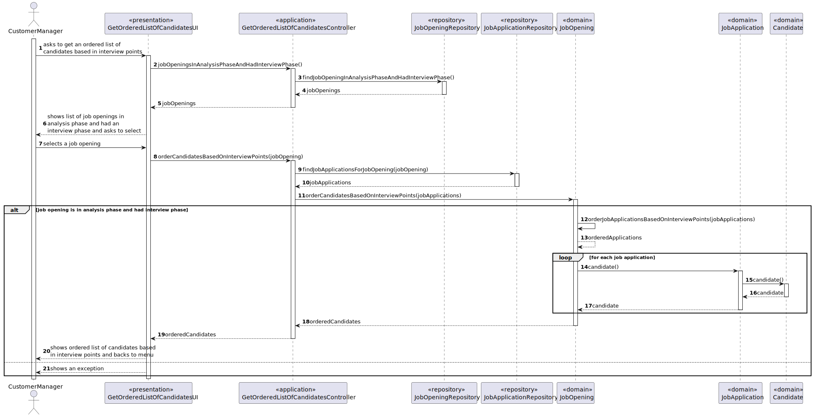

# US 1019

## 1. Context

This task, identified as "US 1019", is part of the Customer Manager feature. The goal of this task is to allow the customer manager to get an ordered list of candidates, using the interview points (grades), to analyze the candidates.

## 2. Requirements

**1019** As Customer Manager, I want to get an ordered list of candidates, using the job
interview points (grades), to help me analyze the candidates.

**Dependencies/References:**

This user story have some dependencies with the following user stories:

| US                                     | Reason                                               |
|----------------------------------------|------------------------------------------------------|
| [1018](../../SprintB/us1018/readme.md) | All interviews made in a job opening must be graded. |

## 3. Analysis

- **The customer manager, after evaluating the interviews for a job opening, is able to get an ordered list of candidates of the applications of this job opening, basing in the interview grades.**

### 3.1. Client meeting

**Question:**

- A lista que pretende é relacionada a uma job opening correto? A maneira de ordenação é ascendente ou quer uma opção que inclua ascendente e descendente?

**Answer:**

- Sim, a ordenação é relativa a candidaturas para um job opening. A ordenação deve ser descendente, do que tem maior pontuação para o que tem menor pontuação.

### 3.2. Business rules

- The job opening should currently be in the analysis phase.
- The job opening should have had an interviewing phase.
- The final list should be showed in descending order.

### 3.3. System functionality

## 4. Design

### 4.1. Realization

### 4.2. Applied Patterns

In the development of this task, we utilized several design patterns to structure our code and ensure its
maintainability and scalability. These patterns include:

- **Repository Pattern:** The Repository pattern was used to create an abstraction layer between the data access layer
  and the business logic layer of the application. This helps to decouple the application and make it easier to maintain
  and test.
- **Service Pattern:** The Service pattern was used to encapsulate business logic and rules. This pattern provides a set of methods that any client application can use, and these methods implement the business rules and logic.
- **Controller Pattern:** The Controller pattern was used in the presentation layer of the application. Controllers
  handle incoming requests, manipulate data using the model, and select views to render to the user.