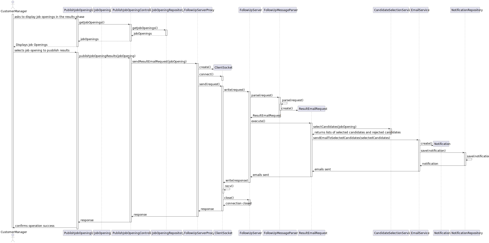

# US 1020 - As Customer Manager, I want to publish the results of the selection of candidates for a job opening, so that the candidates and customer are notified by email of the result.

## 1. Context

This task, identified as "US 1020", is part of the Customer Manager feature. The goal of this task is to allow the customer
manager to publish the results of the selection of candidates for a job opening, so that candidates and the customer are
notified by email of the result.

## 2. Requirements

### 2.1. Acceptance Criteria

- 1. The system should notify the results of the selection of candidates for a job opening.

### 2.2. Dependencies/References

- NFR10 - RCOMP
- NFR11 - RCOMP
- US1013 - As Customer Manager, I want to rank the candidates for a job opening.

### 2.3. Client clarifications

#### 2.3.1. General questions

- **Q48**: Relativamente ao envio das notificações por email, é necessário guardar que esse envio foi feito?
- **A48**: No documento nada de No documento nada de explicito é dito sobre este assunto. No entanto, do ponto de vista de
  gestão do processo da jobs4u parece-me adequado que essa informação fique registada.

- **Q51**: Qual é o formato para essa publicação?
- **A51**:A publicação refere-se a informar os candidatos e o cliente, por email. Os candidatos que são selecionados
  devem receber um email a indicar que para a sua candidatura ao job opening foram selecionados e irão ser contactados pela empresa.
  No que se refere à empresa, esta deve receber um email com a lista dos candidatos selecionados que deve incluir o nome e dados de contacto do candidato.

- **Q190**: Regarding the selection of candidates, should we assume that the first N candidates in the ranking
  (where N is the number of job vacancies) are chosen, or should we allow the customer manager to select the N candidates?
- **A190**: The first option (using the results from US1013).

- **Q224**: Esta US pede que seja publicado os resultados das candidaturas, a minha pergunta seria se este processo só
  pode acontecer quando a job opening estiver encerrada ou se executar esta operação terminaria a job opening.
- **A224**: Esta US é relativa à última fase do processo. Se as notificações executarem todas com sucesso em princípio
  já não existe mais nada a fazer neste processo.

## 3. Analysis

### What is asked?

The task requires implementing a feature for the customer manager to publish the results of the selection of candidates
for a job opening, so that candidates and the customer are notified by email of the result. The selection of candidates
must be based on the current ranking of the Job Opening. The email directed to the candidates must inform them that they
were selected and that they will contacted soon by the Company they applied to.

This feature must comply with specific technical requirements, including a client-server architecture where the client accesses data through a server application.
Additionally, the solution must be deployed on multiple network nodes, with separate nodes for the database server and Follow-Up Server,
ideally in the cloud, ensuring background execution of email notifications. The SMTP application protocol must be used 
to send the email messages trough the SMTP server with DNS name frodo.dei.isep.ipp.pt.

### Domain model

This user story will change the domain model adding and Email Notification to the Domain.

### How is it supposed to work?

After booting up the BackOffice Application, the Customer Manager should be able to publish the results of the selection of candidates for a job opening.
To achieve this, the Customer Manager must follow the steps below:
1. Access the system as a Customer Manager.
2. Access the Job Openings Menu.
3. Select the option to publish of a Job Opening.
4. Selects the Job Opening he wants to publish the results.
5. The system should notify by email the results of the selection of candidates for the job opening.

### SSD

### Impact in the business

These implementations will allow the customer manager to publish the results of the selection of candidates for a job opening,
and automatically notify the candidates and the customer of the result. This will make the process more efficient and transparent,
and will help to keep all parties informed of the status of the job opening.

## 4. Design

### 1. Protocol Description

- **TCP-based Client-Server Protocol**: This protocol uses TCP (Transmission Control Protocol) to establish a connection between the client and server applications. The client initiates the connection using the server's IP address or DNS name and the specified TCP port number.
- **Connection Establishment**: After the TCP connection is established, the client and server exchange messages in the specified format. The connection remains open for ongoing data exchanges while the client application is active.
- **Message Exchange Pattern**: The communication follows a strict client-server pattern where the client sends a request and the server replies with a response.

### 2. Communication Protocol

- **Native Sockets**: Communication is done through native sockets and the content of the messages is always encoded as an array of bytes.
  Data is formatted as array of bites, with non-numeric values translated to their byte value (ASCII code in the case of Strings and Chars).
- **Message Types**: The protocol supports this type of messages:

  - `PUBLISH_OPN`

- **Message Format**: The messages are formatted as an array of bytes, with the first byte representing the message version and the second representing the type of message.
  The following bytes representing the message content. Each data field is preceded by two bytes indicating the field size.

| BYTE                                                                   | DESCRIPTION |
|------------------------------------------------------------------------|-------------|
| 0                                                                      | VERSION     |
| 1                                                                      | TYPE        |
| 2                                                                      | DATA1_LEN_L |
| 3                                                                      | DATA1_LEN_M |
| 4 TO 4 + DATA1_LEN_L + DATA1_LEN_M * 256                               | DATA1       |
| DATA1_OFFSET + 1                                                       | DATA2_LEN_L |
| DATA1_OFFSET + 2                                                       | DATA2_LEN_M |
| DATA1_OFFSET + 3 TO DATA1_OFFSET + 3 + DATA2_LEN_L + DATA2_LEN_M * 256 | DATA2       |
| ...                                                                    | ...         |

- **Message Codes**

These are the message code relevant to this user story:

| CODE | DESCRIPTION  |
|------|--------------|
| 0    | COMMTEST     |
| 1    | DISCONN      |
| 2    | ACK          |
| 3    | ERR          |
| 4    | AUTH         |
| 87   | PUBLISH_OPN  |

- **Client Connection Handling**: To maintain a good client connection, the client must send a `DISCONN` message before closing the connection.

### 3. Error Handling

- **ERR Message**: The server sends an `ERR` message to the client when an error occurs. The message contains a description of the error.

- If the server does not understand the message it will reply with an `UNKNOWN_REQUEST` message which has the following format:

    UNKNOWN_REQUEST, «request»

- Where `request` is the content the server has received. For instance, if the server receives a message `PUBLISH_OPN user1`, it will reply with

    UNKNOWN_REQUEST, "JOB_APPLICATIONS_REQUEST user1"

- If there is a syntax error on the request, that is, the request is known but does not conform to the specification, the server will reply with:

    ERROR_IN_REQUEST, «request», «error-description» 

- If there is a semantic error on the request (e.g., unknown user id), the server will reply with

    BAD_REQUEST, «request», «error-description»

- If there is a problem executing the request (e.g., the server cannot execute the action), the server will reply with

    SERVER_ERROR, «request», «error-description»

### 4. PUBLISH_OPN

The PUBLISH_OPN message has the following format

    PUBLISH_OPN, «job reference»

Where `candidate_email` is the email of the candidate that wants to list his job applications.

#### 4.1 Server Response

The server will reply with a `DATA` message containing the list of job applications and their state including the number of applicants

### 5. Use case realization

This responsibility will be assigned the `backoffice` application since all the existing applications are for user interaction,
while this one does not require user interaction.

For this user story we will use the `PublishJobOpeningResultsController`, this allows to list all the job openings and 
select which one to notify the candidates of the results.
This controller will be used in the `backoffice` application of the project.

The protocol parsing and command execution will be in the `FollowUp` application of the project using a proxy that connects 
the `backoffice` application to the server.

The server receives the request, parses it, and calls the EmailService. The EmailService will send the email notification to the candidates.

This responsibility will be assigned to a new application (`FollowUpDeamon`) since all the existing applications are for
user interaction, while this one does not require user interaction.
The server must be resilient to badly formed input as well as abrupt connection closing from the client.

#### 5.1. Sequence Diagram

### 6. Tests

We will leave the threading part out of scope and will focus on the `BookingProtocolMessageParser` and `BookingProtocolRequest` classes.
the only way ot test the functionality of this user story is to test the email sending, so we will focus on that, 
so with that in mind its impossible to create unit tests for this user story.

## 5. Implementation

For the implementation of this user story, we need to create some components, that work together:

- **User Interface (PublishJobOpeningResultsUI.java):** This component is responsible for the interaction with the user.
- **Controller (PublishJobOpeningResultsController.java):** This component is responsible for get the Job Opening and send the email to the candidates.
-  **Repository (JobOpeningRepository):** The JobOpeningRepository class is responsible for keeping the data of the JobOpenings.
- **Repository (JobApplicationRepository):** The JobApplicationRepository class is responsible for keeping the data of the JobApplication, needed for the candidates email.
- **Repository (NotificationRepository):** The NotificationRepository class is responsible for keeping the data of the Notifications, used to keep records of the notifications sent.
- **Service (SelectCandidatesService.java):** The SelectCandidatesService class is where the business logic for selecting the candidates to notify resides.
- **Service (EmailService.java):** The EmailService class is where the business logic for sending the email notifications resides.
- **Server (Followup Server):**: This user story works throw a server, all the connections to de database passes throw the server.
The backoffice app doesnt have access to email services nor the DNS, so the server is responsible for handling the email sending.

## 6. Integration/Demonstration

### Integration

To integrate the components, we need used some components that already exist in the system, like repositories. The integration of this components with the new components was not very clear and easy to do, because the new ideia of server,
where all data that goes to and comes from database passes throw the server. This integration was hard to understand and implement.

### Demonstration

To demonstrate the implementation of this user story, we can use the following steps:
1. Start the application and log in as a customer manager.
2. Navigate to the job opening section and select the option to publish the results of a job opening.
3. Select the job opening that you want to publish the results.
4. The system should notify the candidates and the customer by email of the result.

