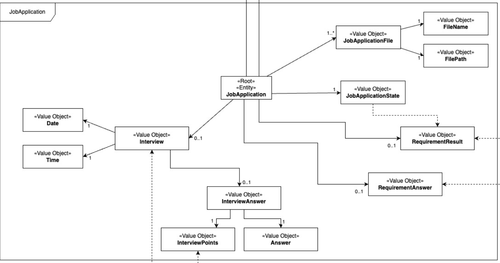
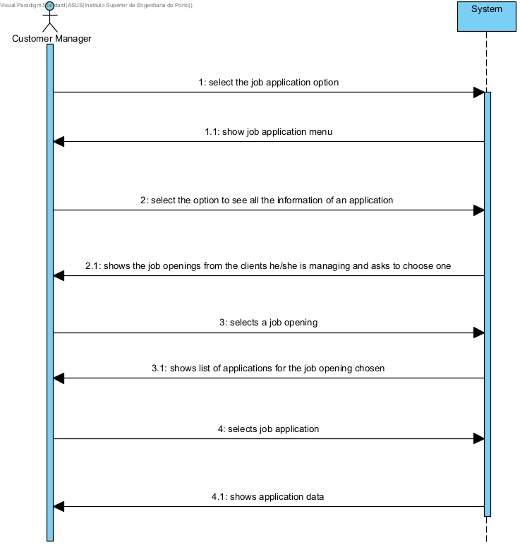
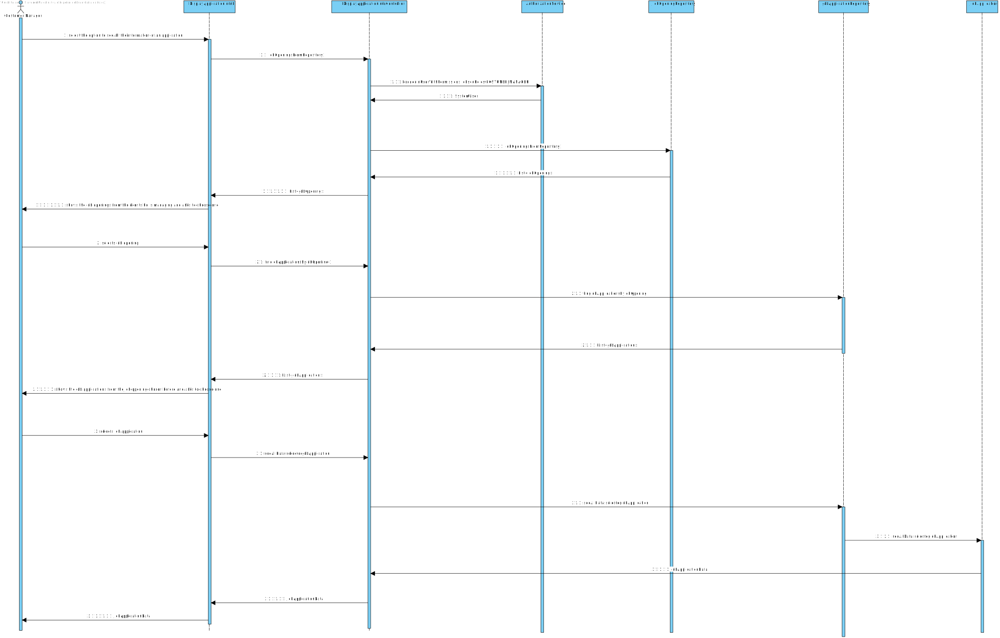
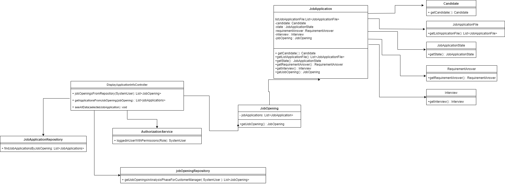

# US 1021 - As Customer Manager, I want to display all the data of an application.

## 1. Context

This task, identified as "US 1021", is part of the Customer Manager feature. The goal of this task is to allow the
customer manager to see the all the information of an application.

## 2. Requirements

**1021** As Customer Manager, I want to display all the data of an application.

**Dependencies/References:**

This user story have some dependencies with the following user stories:

| US                                      | Reason                                                                                                                                                 |
|-----------------------------------------|--------------------------------------------------------------------------------------------------------------------------------------------------------|
| [G007](../../SprintB/g007/readme.md)    | We need the authentication to ensure is a customer manager that is logged                                                                              |
| [1002](../../SprintB/us1002/readme.md)  | The application will be placed in order to compete for a job opening, therefore there must be a job opening in the system                              |
| [1005](../../SprintB/us2000a/readme.md) | The costumer manager will need to choose between the applications. Since in us1005 the applications for a job opening are listed, the us´s are related |
| [2002](../../SprintB/us2002/readme.md)  | The application to be analyzed  must have been applied for a job opening in question                                                                   |

## 3. Analysis

### What is asked?

The customer manager must be able to see all the information of an application for a job opening.

The information in question will be the files submitted by the candidate as well as data collected or generated during
the
process (such as interviews and requirements processing).

#### 1. How does display all information of an application work?

- The customer manager selects the job opening from wich he wants to analyze the applications.
- He will then proceed to choose the application that he wants to analyze.
- It will then be displayed all the information of the application chosen.

### Domain model

To implement this user story there will be no changes needed to the domain model

- The entity Job Application will have his value object objects displayed for the costumer manager.

### Doubts to the client

- O que é “all data of an application”? O que é uma job application?

  > **Answer:** Uma job application é uma candidatura (de um candidato) a uma job opening. Relativamente ao “all data of
  an application” refere-se a todos os dados de uma candidatura, nomeadamente, os ficheiros submetidos pelos candidato
  assim como dados recolhidos ou gerados durante o processo (como as entrevistas e processamento de requisitos).

- Relativamente à US1021, como é que a Application a exibir é escolhida? O utilizador pode começar por selecionar uma
  Job Reference e depois o e-mail de um dos candidatos? Ou recomenda uma outra abordagem?

> **Answer:** Devem aplicar melhores práticas de UX/UI. Já houve perguntas anteriores sobre assuntos similares (ex:
> Q150). Note que existe uma US para listar todas as candidaturas a um job opening, por exemplo.

- Em relação à listagem dos dados de uma determinada jobApplication, um customer manager vai ter acesso a todas as
  jobApplications do sistema ou apenas às jobApplications feitas para uma job opening de um cliente que é gerido por
  esse customer manager?

> **Answer:** Apenas às que está a gerir.

- Listagem das applications - Gostaria de abordar um ponto específico relacionado à UI/UX User Story 1021. Eu sei que o
  cliente tem vindo a referir que devemos aplicar melhores práticas de UX/UI e que preferia não constrangir a forma como
  desenhamos a UI/UX. No entanto, a nossa preocupação é que, nesta US, no caso de haver um grande número de aplicações,
  a exibição de todas essas informações de uma vez poderá ficar confusa para o user. Por isso, queria apenas perguntar
  se poderíamos adotar uma solucão um pouco mais prática, como, por exemplo, pedir ao user para selecionar uma job
  opening e só depois listar as applications associadas a essa job opening e os dados dessas applications ou se, na sua
  visão, esta abordagem poderia restringir demasiadamente as opções oferecidas por esta funcionalidade.

> **Answer:** Ver Q36. Esta US é para mostrar os dados de uma (1) candidatura. Deve haver uma forma do Customer Manager
> indicar (incluindo, eventualmente, forma de selecionar/”saber”/”pesquisar”) qual a candidatura (i.e., application) e o
> sistema mostra os dados dessa candidatura.

### Client Clarifications

These clarifications were made with the client to better understand the requirements of the user story. All questions
and aswers are available in
this [file](https://myisepipp-my.sharepoint.com/:w:/g/personal/atb_isep_ipp_pt/EUuTReNeiM1NorupBbiS9hQB38kUh5TPLca7uDYEitSeZg?e=I5ymVX).

- The costumer manager will only have access to job applications for job openings of clients that he is managing.
- All application data must be presented, namely the files submitted by the candidate
  as well as data collected or generated during the process (such as interviews and requirements processing).

### How is supposed to work?

To see all the information of an application you should follow the next steps:

1. The user should be logged in as a Customer Manager.
2. The customer manager selects the Job Application option, and then one option to see all data of an application.
3. The system will then show the job openings from the clients he is managing and he will have to choose one.
3. The system will show to the customer manager all the job applications from the job opening chosen.
4. The customer manager selects the job application in wich he wants to schedule an interview.
5. It will then be displayed all teh information about the application chosen.

### SSD

 

### Dependencies to other user stories

- [Dependencies table](#dependencias)

### Impact in the business

- The customer manager will be able to see all the information of the applications for the job openings of the clients he is managing.
- This way he can see the data from the candidate, wich can help in choosing the right candidate for the
  job.

## 4. Design

### 4.1. Realization

### 4.2. Class Diagram

### 4.3. Applied Patterns

- **Repository Pattern:** Repository Pattern is an essential for managing data access in a way that promotes clean
  separation of concerns, flexibility, and testability.

- **Controller Pattern:** Is essential for managing the interaction between the user interface and the business logic of
  an application. By clearly separating concerns into models, views, and controllers, applications become more modular,
  easier to develop, test, and maintain.

### 4.4. Tests

#### 4.4.1. Unit Tests

##### Interview Class

- **Test 1:** Test toString method in every attribute that is going to be displayed

#### 4.4.2. Integration Tests

- **Test 1:** Test seing if every attribute of the application is displayed

## 5. Implementation

For the implementation of this user story, we need to create some components, that work together:

- **User Interface (DisplayApplicationInfoUI.java):** This component is resposible for the interaction with the user.
  It shows the job openings that are in the responsibility of the customer manager. It also
  shows the list of applications  for the job opening and waits for the customer manager to choose one.

- **Controller (DisplayApplicationInfoController.java):** The DisplayApplicationInfoController class is responsible for
  handling the user input and calling the appropriate service methods schedule to see all information of an application. It
  receives the job opening and the list of candidates from the UI and passes them to the service layer for processing.
  It also handles the response from the service layer and send the response back to the UI.

- **Repository (JobOpeningRepository):** The JobOpening class is responsible for managing the persistence of the
  JobApplication objects. It provides methods for saving, updating, and retrieving JobApplication objects from the database.

## 6. Integration/Demonstration

### Integration

To integrate the components, we need used some components that already exist in the system, like repositories the
jobOpening and JobApplication classes.
The integration of this components with the new components was clear and easy to do, because the new components are very
simple and don't have a lot of dependencies.

### Demonstration

To demonstrate the implementation of this user story, we can use the following steps:

1. Login as a Customer Manager
2. Select the Application option
3. Select the see all data of an application option
4. The system will show the job openings that are the responsibility of the customer
   manager, and the customer manager selects the job opening in wich he wants to see the applications.
5. The system will show the list of applications of the job opening, and the customer manager will need to choose one.
6. All information of the application will be displayed.

## 7. Observations

Nothing to report. 
