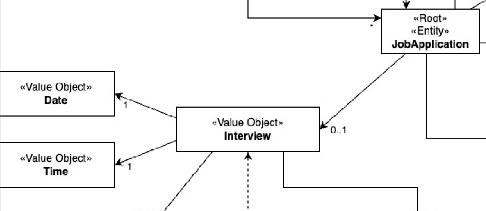

# US 1021 - As Customer Manager, I want to display all the data of an application.

## 1. Context

This task, identified as "US 1021", is part of the Customer Manager feature. The goal of this task is to allow the
customer manager to see the all the information of an application.

## 2. Requirements

**1021** As Customer Manager, I want to display all the data of an application.

**Dependencies/References:**

This user story have some dependencies with the following user stories:

| US                                      | Reason                                                                                                                                                 |
|-----------------------------------------|--------------------------------------------------------------------------------------------------------------------------------------------------------|
| [G007](../../SprintB/g007/readme.md)    | We need the authentication to ensure is a customer manager that is logged                                                                              |
| [1002](../../SprintB/us1002/readme.md)  | The application will be placed in order to compete for a job opening, therefore there must be a job opening in the system                              |
| [1005](../../SprintB/us2000a/readme.md) | The costumer manager will need to choose between the applications. Since in us1005 the applications for a job opening are listed, the us´s are related |
| [2002](../../SprintB/us2002/readme.md)  | The application to be analyzed  must have been applied for a job opening in question                                                                   |

## 3. Analysis

### What is asked?

The customer manager must be able to see all the information of an application for a job opening.

The information in question will be the files submitted by the candidate as well as data collected or generated during the
process (such as interviews and requirements processing).

#### 1. How does display all information of an application work?

- The customer manager selects the job opening from wich he wants to analyze the applications.
- He will then proceed to choose the application that he wants to analyze.
- It will then be displayed all the information of the application chosen.

### Domain model

To implement this user story there will be no changes needed to the domain model

- The entity Job Application will have his value object "Interview" changed
- The value object interview will have the value objects "date" and "time" changed

### Doubts to the client

- Uma entrevista pode ter apenas uma questão? US1014, time and date, quer dizer data de inicio e não data final? Podem
  haver entrevistas em paralelo?

  > **Answer:** Quanto ao número de perguntas numa entrevista, não está definido nenhum limite inferior ou superior. Ou
  seja, pode haver uma entrevista com apenas 1 pergunta (não fará sentido não ter perguntas). A US1014 refere-se à
  marcação da data de uma entrevista com um candidato. Algo como indicar o dia e a hora (ex: 23 de abril pelas 14:00).
  Em relação à marcação de entrevistas “sobrepostas” (com a mesma data de inicio), neste momento, seria algo a
  permitir (pode, por exemplo, o customer manager delegar noutra pessoa a condução da entrevista). Isso não invalida que
  devam validar se as entrevistas ocorrem dentro da fase das entrevistas.

- Em relação à marcação da intervista, só deve ser possível marcar esta data quando? Só será possível marcar a
  entrevista quando a fase de recrutamento se encontrar na fase de intervista? Ou será possivel marcar noutras fases
  anteriores?

> **Answer:** Por mim pode ser possível marcar as entrevistas antes mas deve-se ter em atenção se o candidato “passou” o
> screening. Não faz sentido marcar uma entrevista para um candidato que não foi aceite. Tenham em atenção este tipo de
> aspetos.

- In the us "US 1014 - As Customer Manager, I want to record the time and date for an interview with a candidate." Is it
  possible to schedule interviews for any day and time or we must take into account weekends, working hours and
  holidays, for example?

> **Answer:** The system should display the day of the week for the selected date. But the system should accept any
> valid date.

- Em relação à marcação de uma entrevista com um candidato, deve ser possível marcar mais do que uma entrevista por
  candidatura?

> **Answer:** O sistema nesta fase está pensado para apenas suportar uma entrevista por job opening por isso não faz
> muito sentido marcar mais do que uma entrevista para um candidato a não ser para remarcar a mesma entrevista (por
> exemplo, o candidato faltou justificadamente a uma entrevista anterior). Neste contexto, eu diria que faz mais sentido
> poder alterar a marcação de uma entrevista do que marcar mais do que uma entrevista para o mesmo candidato.

### Client Clarifications

These clarifications were made with the client to better understand the requirements of the user story. All questions
and aswers are available in
this [file](https://myisepipp-my.sharepoint.com/:w:/g/personal/atb_isep_ipp_pt/EUuTReNeiM1NorupBbiS9hQB38kUh5TPLca7uDYEitSeZg?e=I5ymVX).

- There may be interviews to take place at the same time for the same job opening
- A candidate will at maximum have one interview for the job opening
- Interviews can be scheduled at any time, however, they will only happen if the candidate in question has passed the
  screening phase
- The system should display the day of the week for the selected date.
- The system should accept any valid date

### How is supposed to work?

To record a time and date for an interview with a candidate you should follow the next steps:

1. The user should be logged in as a Customer Manager.
2. The customer manager selects the Job Application option, and then one option to record the time and date for an
   interview.
3. The system will then show the job openings from the clients he is managing and he will have to choose one.
3. The system will show to the customer manager all the job applications from the job opening chosen that passed the
   Screening phase and will have
   an interview ocurring in the future.
4. The customer manager selects the job application in wich he wants to schedule an interview.
5. He will then be asked to choose a time and a date for the interview.
6. Finaly the system will confirm with the user the date (with the day of the week) and the time chosen by the customer
   manager.

### SSD

### Dependencies to other user stories

- [Dependencies table](#dependencias)

### Impact in the business

- The customer manager will be able to schedule interviews with candidates for job openings.
- This way he can collect other type of data from the candidate, wich can help in choosing the right candidate for the
  job.

- ´+«'0«'6-4321«'098761q234567890'«'0167890'+«'43 vc. nbvc+# 4. Design
-

### 4.1. Realization

### 4.2. Class Diagram

### 4.3. Applied Patterns

- **Repository Pattern:** Repository Pattern is an essential for managing data access in a way that promotes clean
  separation of concerns, flexibility, and testability.

- **Controller Pattern:** Is essential for managing the interaction between the user interface and the business logic of
  an application. By clearly separating concerns into models, views, and controllers, applications become more modular,
  easier to develop, test, and maintain.

### 4.4. Tests

#### 4.4.1. Unit Tests

##### Interview Class

- **Test 1:** Test set date for an interview
- **Test 2:** Test set time for an interview
- **Test 5:** Test the ToString method

#### 4.4.2. Integration Tests

- **Test 1:** Test setting a date and time for an interview that is not suposed to occur
- **Test 2:** Test setting a date and time for an interview that is suposed to occur
- **Test 3:** Test setting a date and time for an interview that is suposed to occur but the candidate did not pass the
  screening phase

## 5. Implementation

For the implementation of this user story, we need to create some components, that work together:

- **User Interface (recordTimeDateInterviewUI.java):** This component is resposible for the interaction with the user.
  It shows the job openings that are in the Analysis phase and are the responsibility of the customer manager. It also
  shows the list of candidates that applied for the job opening and waits for the customer manager to write the rank of
  the candidates.

- **Controller (recordTimeDateInterviewController.java):** The rankJobOpeningController class is responsible for
  handling the user input and calling the appropriate service methods schedule a date and time for an interview. It
  receives the job opening and the list of candidates from the UI and passes them to the service layer for processing.
  It also handles the response from the service layer and send the response back to the UI.

- **Repository (JobApplicationRepository):** The JobApplication class is responsible for managing the persistence of the
  Interview objects. It provides methods for saving, updating, and retrieving Interview objects from the database.

## 6. Integration/Demonstration

### Integration

To integrate the components, we need used some components that already exist in the system, like repositories the
jobOpening and JobApplication classes.
The integration of this components with the new components was clear and easy to do, because the new components are very
simple and don't have a lot of dependencies.

### Demonstration

To demonstrate the implementation of this user story, we can use the following steps:

1. Login as a Customer Manager
2. Select the Rank option
3. Select the Register Rank for Job Opening option
4. The system will show the job openings that are in the Analysis phase and are the responsibility of the customer
   manager, and the customer manager selects the job opening that he wants to rank the candidates.
5. The system will show the list of candidates that applied for the job opening, and the customer manager writes the
   email of the candidates separated by a comma.
6. In case of ranking candidates from a jobOpening that already has a rank, the system displays the current rank to the
   customer manager, and asks for the new rank.
6. The system shows the rank inserted

## 7. Observations

In case of register a ranking for a jobOpening that already has a ranking, the system displays to the customer manager
the current ranking.
