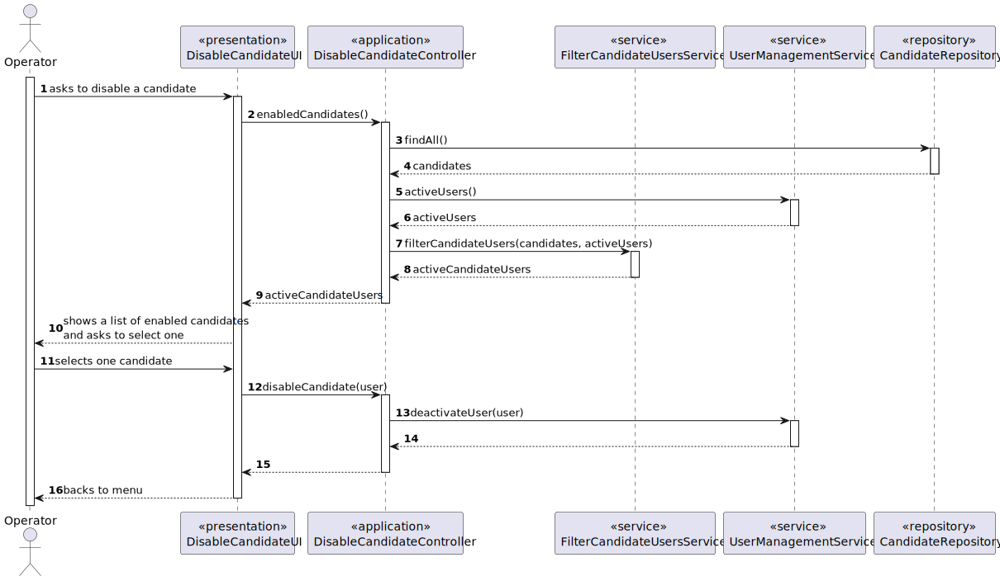
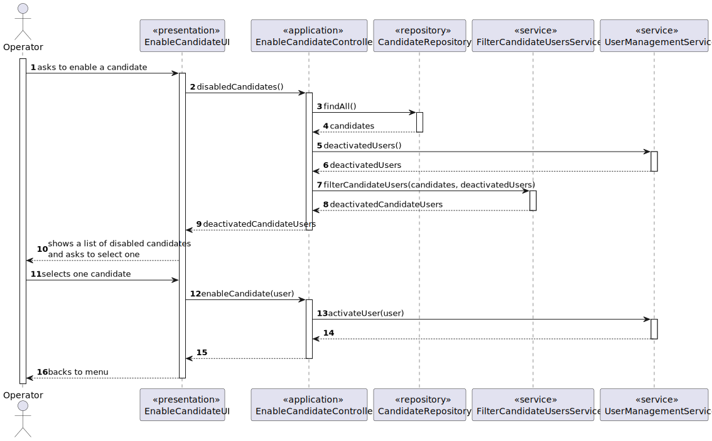

# US 2000b

## 1. Context

This task, identifies as "US 2000b", is part of the Operator feature. The goal of this task is to allow the operator to enable/disable a candidate from the his app (Candidate app).

This is the first task that is directly related to the rank feature of the system.

## 2. Requirements

**2000b** As Operator, I want to enable/disable a candidate.

**Dependencies/References:**

This user story have some dependencies with the following user stories:

| US                                      | Reason                                          |
|-----------------------------------------|-------------------------------------------------|
| [2000a](../../SprintB/us1002/readme.md) | The candidate must be registered in the system. |

## 3. Analysis

- **The operator, after registering the candidate in the system, is able to enable/disable him from his app (i.e. Candidate App).**

### 3.1. Client meeting

**Question:**

- A mudança de estado é referente ao candidato ou à candidatura individual e como se relaciona com o enable/disable dos utilizadores?

**Answer:**

- O enable/disable dos users é apenas para controlar os acessos ao sistema.

**Question:**

- O que é o enable/disable do candidato?

**Answer:**

- Refere-se a desativar o acesso do candidato ao sistema (i.e., Candidate App).

### 3.2. Business Rules

- The operator should select a candidate at a time.

### 3.3. System functionality

#### 3.3.1. Enable a candidate

#### 3.3.2. Disable a candidate

## 4. Design

### 4.1. Realization

#### 4.1.1. Disable a candidate

#### 4.1.2. Enable a candidate

### 4.2. Applied patterns

In the development of this task, we utilized several design patterns to structure our code and ensure its
maintainability and scalability. These patterns include:

- **Repository Pattern:** The Repository pattern was used to create an abstraction layer between the data access layer
  and the business logic layer of the application. This helps to decouple the application and make it easier to maintain
  and test.
- **Service Pattern:** The Service pattern was used to encapsulate business logic and rules. This pattern provides a set of methods that any client application can use, and these methods implement the business rules and logic.
- **Controller Pattern:** The Controller pattern was used in the presentation layer of the application. Controllers
  handle incoming requests, manipulate data using the model, and select views to render to the user.

## 5. Implementation

### 5.1. Enable a candidate

The process of enabling a Candidate in this system involves several components working together. Here's a step-by-step
explanation

- **User Interface (EnableCandidateUI.java)**: The process starts in the EnableCandidateUI class, which is
  responsible for interacting
  with the user. It prompts the user to enter the necessary information.
  This class uses the EnableCandidateController to handle the business logic.
- **Controller (EnableCandidateController.java):** The EnableCandidateController class is the bridge between the
  UI and the business
  logic.
- **Repository (CandidateRepository.java):** The JobOpeningRepository is an interface that defines the methods for
  interacting with the
  database. It extends the DomainRepository interface, which provides methods for basic CRUD operations.
- **Service (UserManagementService.java):** The UserManagementService class is where the actual business logic for user management resides. It uses the UserRepository to interact with the database. When listing users, it retrieves all SystemUser objects from the database using the UserRepository.  
- **Service (FilterCandidateUserService.java):** The FilterCandidateUserService class is where the business logic for finding candidate users resides.

### 5.2. Disable a candidate

The process of disabling a Candidate in this system involves several components working together. Here's a step-by-step
explanation

- **User Interface (DisableCandidateUI.java)**: The process starts in the EnableCandidateUI class, which is
  responsible for interacting
  with the user. It prompts the user to enter the necessary information.
  This class uses the DisableCandidateController to handle the business logic.
- **Controller (DisableCandidateController.java):** The DisableCandidateController class is the bridge between the
  UI and the business
  logic.
- **Repository (CandidateRepository):** The JobOpeningRepository is an interface that defines the methods for
  interacting with the
  database. It extends the DomainRepository interface, which provides methods for basic CRUD operations.
- **Service (UserManagementService.java):** The UserManagementService class is where the actual business logic for user management resides. It uses the UserRepository to interact with the database. When listing users, it retrieves all SystemUser objects from the database using the UserRepository.
- **Service (FilterCandidateUserService.java):** The FilterCandidateUserService class is where the business logic for finding candidate users resides.

## 6. Demonstration

To demonstrate this functionality follow the steps below:

### 6.1. Enabling a candidate

1. Start the application and log in as a operator.
2. Navigate to the candidate section and select the option to enable a candidate.
3. Select the disabled candidate.

### 6.3. Disabling a candidate

1. Start the application and log in as a operator.
2. Navigate to the candidate section and select the option to enable a candidate.
3. Select the enabled candidate.