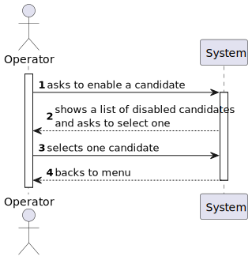
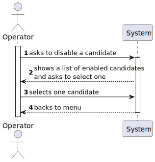

# US 2000b

## 1. Context

This task, identifies as "US 2000b", is part of the Operator feature. The goal of this task is to allow the operator to enable/disable a candidate from the his app (Candidate app).

This is the first task that is directly related to the rank feature of the system.

## 2. Requirements

**2000b** As Operator, I want to enable/disable a candidate.

**Dependencies/References:**

This user story have some dependencies with the following user stories:

| US                                      | Reason                                          |
|-----------------------------------------|-------------------------------------------------|
| [2000a](../../SprintB/us1002/readme.md) | The candidate must be registered in the system. |

## 2. Analysis

- **The operator, after registering the candidate in the system, is able to enable/disable him from his app (i.e. Candidate App).**

### 2.1. Client meeting

**Question:**

- A mudança de estado é referente ao candidato ou à candidatura individual e como se relaciona com o enable/disable dos utilizadores?

**Answer:**

- O enable/disable dos users é apenas para controlar os acessos ao sistema.

**Question:**

- O que é o enable/disable do candidato?

**Answer:**

- Refere-se a desativar o acesso do candidato ao sistema (i.e., Candidate App).

### 2.2. Business Rules

- The operator should select a candidate at a time.

### 2.3. System functionality

#### 2.3.1. Enable a candidate

#### 2.3.2. Disable a candidate

