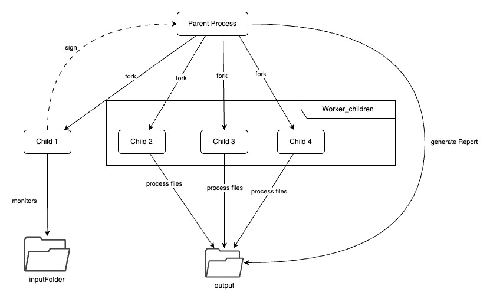

# US 2001

## 1. Context

This task, identified as "US 2001", is being assigned for the first time. The context for this task is continuously
process the files produced by the Applications Email Bot, so that they can be imported into the system by initiative of
the Operator.

## 2. Requirements

**US 2001** As Product Owner, I want the system to, is continuously
process the files produced by the Applications Email Bot, so that they can be imported into the system by initiative of
the Operator.

**Dependencies/References:**

- NFR12(SCOMP) The base solution for the upload of files must be implemented following specific technical requirements
  such as the use of the C programming language with
  processes, signals and pipes. Specific requirements will be provided in SCOMP.

## 3. Analysis

## Client Meeting

- There should not be any duplicate files.
- Regarding the report, there can be multiple report files, each one uniquely identified by some sort of timestamp.
- The report should include information that is enough for diagnosing problems in the import.
- The system should maintain the integrity of the data and that they are not "lost".

## Business Rules

- This US is directly related to the system.
- Process the files produced by the Applications Email Bot is an automated process .
- The files must be processed so that they can lately be imported by the operator into the system.

## 4. Diagram

## 5. Tests

#### Test #1: Execute the program with files previously inserted in the shared folder
- **Test Steps:**
  1. Insert files in the shared folder.
  2. Execute the program.
  3. Check if the files were processed.
  4. Check if the files were moved to the processed folder.
  5. Check if the report was generated.

- **Expected Result:** The files are processed, moved to the processed folder and a report is generated.

#### Test #2: Execute the program with files being inserted in the shared folder during execution
- **Test Steps:**
  1. Execute the program.
  2. Insert files in the shared folder.
  3. Check if the files were processed.
  4. Check if the files were moved to the processed folder.
  5. Check if the report was generated.

- **Expected Result:** The files are processed, moved to the processed folder and a report is generated.

#### Test #3: Execute the program with no files being inserted
- **Test Steps:**
  1. Execute the program.
  2. Wait for his execution to finish.

- **Expected Result:** The program finishes its execution without errors and the only process that executed it was the directory monitoring.

## 6. Implementation

- The file bot was implemented in C.
- The program when executed, creates a child  process that monitors the shared folder for new files and other childs to process the files. When a new file is detected, the child program send a sign to the parent.
- When the parent receives the signal, the parent process sends a signal to the child process that is responsible for processing the files. The child process then processes the files and generates a report.

## 7. Integration/Demonstration

### Integration

To integrate this feature different parts of the code was divided into different files.
- [configFile](..%2F..%2F..%2FJobs4u.FileBot%2FFileBot%2FconfigFile)
- [destributeFiles.c](..%2F..%2F..%2FJobs4u.FileBot%2FFileBot%2FdestributeFiles.c)
- [generateReport.c](..%2F..%2F..%2FJobs4u.FileBot%2FFileBot%2FgenerateReport.c)
- [handleSignals.c](..%2F..%2F..%2FJobs4u.FileBot%2FFileBot%2FhandleSignals.c)
- [header.h](..%2F..%2F..%2FJobs4u.FileBot%2FFileBot%2Fheader.h)
- [main.c](..%2F..%2F..%2FJobs4u.FileBot%2FFileBot%2Fmain.c)
- [makefile](..%2F..%2F..%2FJobs4u.FileBot%2FFileBot%2Fmakefile)
- [monitor_directory.c](..%2F..%2F..%2FJobs4u.FileBot%2FFileBot%2Fmonitor_directory.c)
- [ProcessFile.c](..%2F..%2F..%2FJobs4u.FileBot%2FFileBot%2FProcessFile.c)
- [readConfig.c](..%2F..%2F..%2FJobs4u.FileBot%2FFileBot%2FreadConfig.c)
- [utils.c](..%2F..%2F..%2FJobs4u.FileBot%2FFileBot%2Futils.c)

### Demonstration

Since this funcitonality is a background process, there isn't a way to demonstrate it directly. 

## 8. Observations

- When te process read all the files, generate the report with all information read.
- The report is generated in the same folder as the output files.

