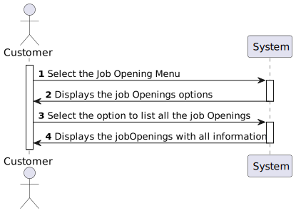

# US 3002 - As Customer, I want to list all my job openings

## 1. Context

This Us is related to RCOMP, the customer should be able to see his job openings, and this information should be accessed by a server.

## 2. Requirements

**3002** As Customer, I want to list all my job openings, including job reference, position, active since, number of applications.

**Dependencies/References:**

This user story have some dependencies with the following user stories:

| US                                       | Reason                                                                            |
|------------------------------------------|-----------------------------------------------------------------------------------|
| [G007](../../SprintB/g007/readme.md)     | Whe need the authentication to ensure is a customer that is logged                |
| [US1002](../../SprintB/us1002/readme.md) | This us is responsible for creating job Openings, that is required to us 3002     |
| [US2002](../../SprintB/us2002/readme.md) | This us is responsible for creating job applications, that is required to us 3002 |

## 3. Analysis

### What is asked?
The task requires implementing a feature for customers to list all their job openings, displaying job reference, position, active since date, and the number of applicants. This feature must comply with specific technical requirements, including a client-server architecture where the client accesses data through a server application, without direct database access. Additionally, the solution must be deployed on multiple network nodes, with separate nodes for the database server and Follow Up Server, ideally in the cloud, ensuring background execution of email notifications.

### Domain model

This user story doesn't have any impact on the domain model.

### Client Clarifications
- Position in this Us, is the same as title or function in the job opening
- In the context of this US, “active since” means the date from the start of the process, the “application” phase (since that date, candidates can apply). This functionality should include all the “active” job openings.

### How is supposed to work?

The customer should be able to list all his job openings, including job reference, position, active since, number of applications. This information should be accessed by a server.
To achieve this, the customer must follow the steps below:
1. Access the system as a customer.
2. Access the job openings Menu.
3. Select the option to list all job openings.
4. The system should display a list of all job openings, including job reference, position, active since, and the number of applications.

### SSD

### Dependencies to other user stories
- [Dependencies table](#dependencias)

### Impact in the business

These implementations will allow the customer to have a better overview of the job openings, making it easier to manage them. It also allow the system to get the information by a server, making it more secure. 

## 4. Design
This functionality will be implemented as a daemon that listens on a well-known IP address and port using TCP as the transport mechanism. 
The client application will need to establish a TCP connection to this server socket using the provided IP address or DNS name and port number. After the connection is established, the client and server will exchange messages according to the specified format, maintaining the connection for all data exchanges (requests and responses) while the client application is active. Configuration details, such as the server's IP address and port, will be specified in the client's setup properties file.

### 1. Protocol Description

- **TCP-based Client-Server Protocol**: This protocol uses TCP (Transmission Control Protocol) to establish a connection between the client and server applications. The client initiates the connection using the server's IP address or DNS name and the specified TCP port number.
- **Connection Establishment**: After the TCP connection is established, the client and server exchange messages in the specified format. The connection remains open for ongoing data exchanges while the client application is active.
- **Message Exchange Pattern**: The communication follows a strict client-server pattern where the client sends a request and the server replies with a response.

### 2. Communication Protocol

- **Native Sockets and UTF-8 Encoding**: Communication uses native sockets with text messages encoded as UTF-8, delimited by a newline character (`\n`). Data is formatted as array of bites, with non-numeric values enclosed in double quotes (e.g., `"JOB_OPENING"`).
- **Message Types**: The protocol supports this type of messages:
    - `GET_JOB_OPENINGS_DATA`
    
- **Client Connection Handling**: To maintain a good client connection, the client must send a `GOODBYE` message before closing the connection.

### 3. Error Handling

If the server does not understand the message it will reply with an `UNKNOWN_REQUEST` message which has the following format:

    UNKNOWN_REQUEST, «request»

Where `request` is the content the server has received. For instance, if the server receives a message `GET_JOB_OPENINGS_DATA user1`, it will reply with

    UNKNOWN_REQUEST, "GET_JOB_OPENINGS_DATA user1"

If there is a sintax error on the request, that is, the request is known but not conformat to the specification, the server will reply with:

    ERROR_IN_REQUEST, «request», «error-description» 

For example:

    ERROR_IN_REQUEST, "GET_JOB_OPENINGS_DATA, user1", "Wrong number of parameters"

If there is a semantic error on the request (e.g., unknown user id), the server will reply with

    BAD_REQUEST, «request», «error-description»

If there is a problem executing the request (e.g., the server cannot execute the action), the server will reply with

    SERVER_ERROR, «request», «error-description»

### 4. GET_JOB_OPENINGS_DATA

The GET_JOB_OPENINGS_DATA message has the following format

    GET_JOB_OPENINGS_DATA, «customer_code»

Where `customer_code` is the code of the customer that wants to list his job openings.

### 5. Use case realization

This responsability will be assigned to a new application (`FollowUpDeamon`) since all the existing applications are for user interaction, while this one does not require user interaction.

For this user story, we will use the `ListJobOpeningForCustomerController`, this allow to list all the job openings for a customer. This controller will be used in the `daemon` application project.

The server must be resilient to badly formed input as well as abrupt connection closing from the client.

The protocol parsing and command execution will be in the `daemon` application project reusing the existing controller from the `core` project.

The server receives the request, parse it, and call the controller. The controller will return the data to the server, that will send it back to the client.

### 4.4. Tests

We will leave the threading part out of scope and will focus on the `BookingProtocolMessageParser` and `BookingProtocolRequest` classes.

For `GET_JOB_OPENINGS_DATA`:
- ensure an empty list (just the header) is returned 
- ensure the jobOpenings are returned in a properly formatted multi-line response 

## 5. Implementation

For the implementation of this user story, we need to create some components, that work together:

- **User Interface (DisplayJobOpeningUI.java):** This component is responsible for the interaction with the user. It shows the jobOpenings and the respective data for the customer 

- **Controller (ListJobOpeningForCustomerController.java):** This component is responsible for get the JobOpenings fot the customer. It receives the customer code and  passes them to the service layer for processing. It also handles the response from the service layer and send the response back to the UI.

- **Repository (JobOpeningRepository):** The JobOpeningRepository class is responsible for searching the jobOpenings for the customer. This class has methods for search.

- **Server (Followup Server):**: This user story works throw a server, all the connections to de database passes throw the server. The customer app and the database doest have direct connection, so a server and all classes that permit the communication and the connection are important to this implementation

## 6. Integration/Demonstration

### Integration
To integrate the components, we need used some components that already exist in the system, like repositories. The integration of this components with the new components was not very clear and easy to do, because the new ideia of server, 
where all data that goes to and comes from database passes throw the server. This integration was hard to understand and implement. 

### Demonstration
To demonstrate the implementation of this user story, we can use the following steps:

1. Ensure the follow up server is running
2. Login as customer
3. Select option Job Opening
4. Select List Job Openings option
5. the system will show the job Opening data for the customer

