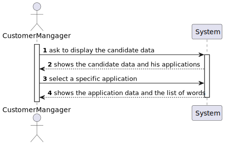
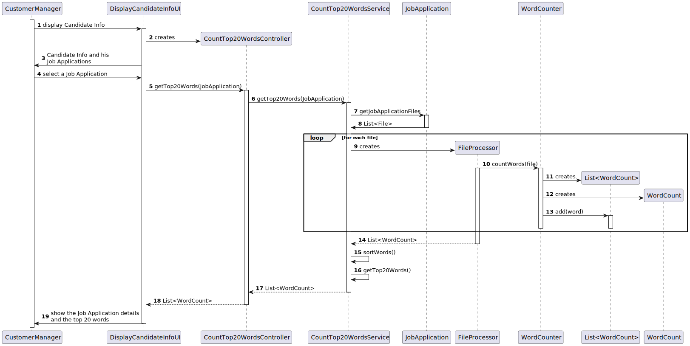
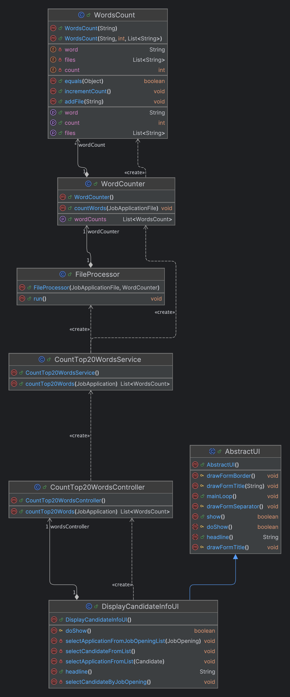

# US 4000

## 1. Context

This us is the related to SCOMP, and is the first time that something like that is developed in this project. The use of threads is required to successfully complete this user story. 

## 2. Requirements

**4000** As a Customer Manager, when displaying the candidate data, I expect the system
to present a top 20 list of the most frequently referenced words from files uploaded by a
candidate. Additionally, I require a comprehensive list of the files in which these words
appear.

**Dependencies:**

This user story have some dependencies with the following user stories:

| US                                     | Reason                                                                     |
|----------------------------------------|----------------------------------------------------------------------------|
| [G007](../../SprintB/g007/readme.md)   | Whe need the authentication to ensure is a customer manager that is logged |    
| [1006](../../SprintB/us1006/readme.md) | Allow us to display the candidate information, that is needed for this US  |

**References:**
The process to count words of very large files should follow specific 
technical requirements such as implementing parallelism and concurrency using Java
and threads. Specific requirements will be provided in SCOMP.

## 3. Analysis

### What is asked?

The principal goal of this user story is to when displaying the candidate information, present a top 20 list of the most frequently referenced words from files uploaded by a candidate. Additionally, a comprehensive list of the files in which these words appear should be presented.

#### How is the order of the list defined?

The order of the list is defined by the number of occurrences of the words. The most referenced words should be at the top of the list.

#### How is the counting of the words done?

The client mentioned that the count of the words depends on the language used in the text. The solution could be complex so the client suggest that there are no restrictions to the words that should be counted.

#### What type of information is important to keep?

The system should keep the list of words and the files in which these words appear. The count of words could be important to keep as well.

### Domain model

This user story does implicate changes in the domain model.

### Doubts to the client

- The order of the list is important? Does it need to be ordered by the number of occurrences of the words?
    >  **Answer:** Yes, the order is important. The system must present a top 20 list, from most referenced words to less referenced words.

- For the word count, should all types of words be counted, or are there words that don't make sense to count, such as conjunctions?
    >  **Answer:** For the moment there are no restrictions like the one you mention since they depend on the language used in the text (the solution could/would be complex).

- When displaying the candidate info is expected to show the list of words for each application of the candidate, or the customer manager needs to select a specific application to see the list of words?
    >  **Answer:** This regards all the possible applications of a candidate that the customer manager is managing.
 

### Client Clarifications
- The list of words is relative to a particular application.
- The order of the list is important. The system must present a top 20 list, from most referenced words to less referenced words.
- The count of the words depends on the language used in the text. The solution could be complex. For the moment, there are no restrictions to the words that should be counted.
- The customer manager can see the list of words for each application of a customer that he manages.

### SSD

### Dependencies to other user stories
- [Dependencies table](#dependencias)

### Impact in the business

This user story will allow the customer manager to have a better understanding of the candidate's profile, by analyzing the most frequently used words in the candidate's applications. This information can be used to identify the candidate's interests, skills, and other relevant information that can be used to evaluate the candidate's profile.

## 4. Design

### 4.1. Realization

### 4.2. Class Diagram

### 4.3. Applied Patterns

- **Repository Pattern:** Repository Pattern is an essential for managing data access in a way that promotes clean separation of concerns, flexibility, and testability.

- **Service Pattern:** The Service Pattern is an essential for organizing business logic in a scalable, maintainable, and reusable way. By implementing a service layer, applications can achieve a clean separation of concerns, making them easier to develop, test, and maintain.

- **Controller Pattern:** Is essential for managing the interaction between the user interface and the business logic of an application. By clearly separating concerns into models, views, and controllers, applications become more modular, easier to develop, test, and maintain.

### 4.4. Tests

#### 4.4.1. Unit Tests

- **Test 1:** Test create the WordCounter object
- **Test 2:** Test create the WordCounter object fails
- **Test 3:** Test the increment of the word count
- **Test 4:** Test the add file works

## 5. Implementation

## 6. Integration/Demonstration

### Integration

### Demonstration

## 7. Observations

